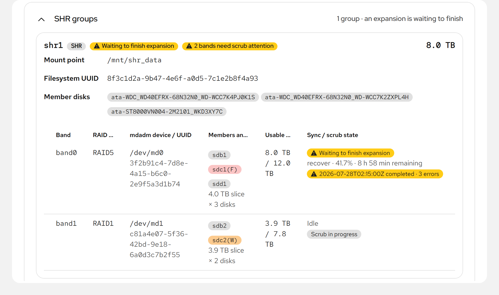
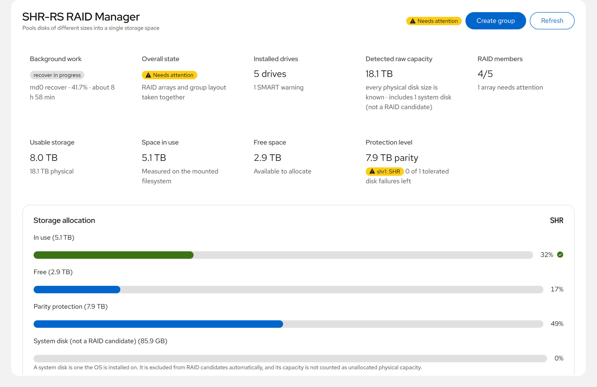
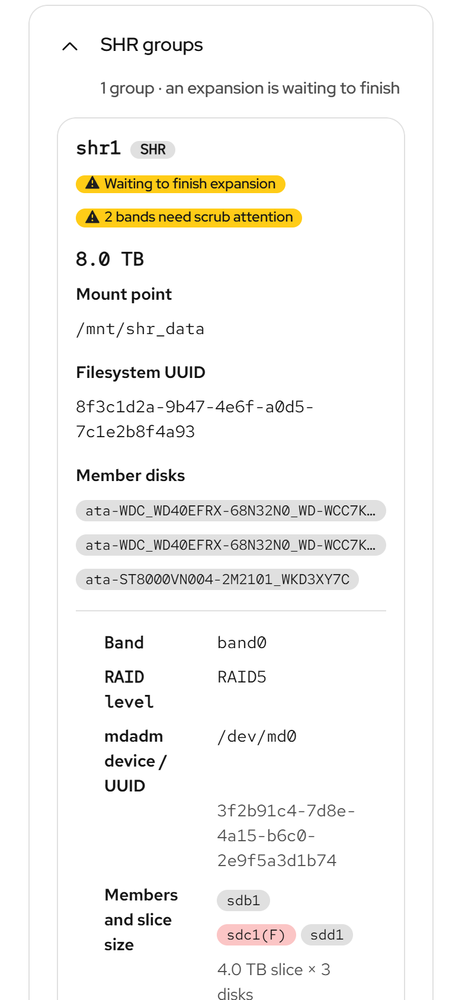

# shr-rs

*Read this in [한국어](README.ko.md).*

**SHR — Sliced Hybrid RAID: mixed-size disks, one pool, nothing but stock
Linux.** `mdadm` + `LVM` + `Btrfs` — no custom kernel module, no proprietary
format, no vendor hardware. If shr-rs disappeared tomorrow your array would
still assemble with the tools already on the system.

**In one sentence:** you have hard disks of different sizes, you want them to
behave as one big drive that survives a disk dying, and you do not want to
waste the extra space on the larger ones. That is what this does.

New to RAID? Open the box below first. Everything after it assumes those few
words.

<details>
<summary><b>The words used in this README</b></summary>

- **RAID** keeps your data on several disks at once so that one disk dying
  does not lose it. It is not a backup: it protects against a disk failing,
  not against deleting the wrong file.
- **Parity** is the extra copy, or the arithmetic that stands in for one. It
  is why a pool of four 4 TB disks stores 12 TB and not 16 TB: one disk's
  worth is spent so any one disk can die.
- **RAID5** survives one disk failing and costs one disk of capacity.
  **RAID6** survives two and costs two. **RAID1** is a plain mirror of two
  disks: half the capacity, either one can die.
- **Band** is this project's own word. Disks of different sizes are cut into
  horizontal slices, and each slice becomes its own small RAID. See the
  picture below.
- **Stranded** space is capacity that exists but cannot be protected, because
  only one disk reaches that high. shr-rs shows it rather than counting it as
  usable.
- **mdadm, LVM, Btrfs** are the three standard Linux tools this drives.
  `mdadm` builds the RAIDs, `LVM` glues them into one volume, `Btrfs` is the
  filesystem you actually store files on. All three ship with your
  distribution; this project gives orders to them and nothing more.
- **Scrub** is a routine read of everything on the disks to find rot before
  you need the data. Run it monthly; the scheduler does it for you.

</details>

## Why

Put a 4 TB, a 4 TB, a 6 TB and an 8 TB disk into one RAID5 and mdadm uses
4 TB from each. Six terabytes — more than a quarter of what you bought —
simply vanish.

shr-rs slices the disks at every capacity boundary and builds a *separate*
array in each band, at the best redundancy level that band's disk count
allows. LVM concatenates the arrays into one volume, and Btrfs goes on top:

```console
$ shr-rs plan create --mode shr --sizes 4TB,4TB,6TB,8TB

Planned layout (mode: shr, DRY RUN)

  BAND   LEVEL         SLICE MEMBERS      USABLE
  band0  raid5        4.0 TB       4     12.0 TB
  band1  raid1        2.0 TB       2      2.0 TB

  Usable 14.0 TB   Parity 6.0 TB   Stranded 2.0 TB   Raw 22.0 TB
  [#########################+++++++++++....]  (9% wasted)

  ! disk3: 2001454759936 B stranded (no redundancy)
```

Reading that, line by line, because it is the densest output here:

- `band0  raid5  4.0 TB  4  12.0 TB` means all four disks contribute their
  first 4 TB, those four slices form a RAID5, and after parity that band
  stores 12 TB.
- `band1  raid1  2.0 TB  2  2.0 TB` means only two disks reach higher (the
  6 TB and the 8 TB), so their next 2 TB pair up as a mirror worth 2 TB.
- `Stranded 2.0 TB` is the top of the 8 TB disk. No second disk reaches that
  high, so nothing can protect it and shr-rs refuses to count it as capacity.
- The bar is that same story as a picture: `#` data, `+` parity, `.` stranded.

14 TB usable instead of 12, still single-disk-fault tolerant — and it says
plainly which 2 TB it cannot protect and why, rather than quietly counting
them as capacity. That slicing is what the name describes: **SHR** is
*Sliced Hybrid RAID*, hybrid because one pool is several RAID levels at once.
**SHR-2** (`--mode shr2`) is the same idea at two-disk tolerance.

Here are the same two bands in the web dashboard: one group, two mdadm arrays
at different RAID levels, each with its own slice size, members and rebuild
state.

<picture>
  <source media="(prefers-color-scheme: dark)" srcset="docs/images/group-bands-dark.png">
  
</picture>

## How it works

```
disks → GPT partitions → mdadm bands (md0, md1, …) → LVM VG (linear) → LV → Btrfs (zstd)
```

- **Bands.** Each distinct capacity step becomes one partition per
  participating disk and one mdadm array. Four disks in a band means RAID5
  (or RAID6 in SHR-2); two means RAID1; one means the space is stranded and
  reported as such.
- **LVM.** The arrays are concatenated linearly into a single volume group,
  so adding a band later extends the same filesystem rather than creating a
  second one.
- **Btrfs.** Transparent zstd compression, subvolumes (`@`, `@snapshots`),
  snapshots with retention, and its own scrub alongside mdadm's.
- **Expansion is online.** Adding a disk re-plans the bands, grows the arrays
  in place, extends the VG, LV and filesystem, and throttles the rebuild
  against live I/O so the array stays usable while it reshapes.

## Install

Two packages. `shr-rs` is the engine — the CLI and TUI, usable on their own.
`cockpit-shr-rs` is the optional web dashboard and depends on it.

Every `v*` tag publishes to
[GitHub Releases](https://github.com/heavycaffeiner/shr-rs/releases):

| Target | engine | dashboard |
|---|---|---|
| Rocky / RHEL / CentOS Stream **9** | `shr-rs-*.el9.x86_64.rpm` | `cockpit-shr-rs-*.el9.noarch.rpm` |
| Rocky / RHEL / CentOS Stream **10** | `shr-rs-*.el10.x86_64.rpm` | `cockpit-shr-rs-*.el10.noarch.rpm` |
| Debian / Ubuntu | `shr-rs_*_amd64.deb` | `cockpit-shr-rs_*_all.deb` |
| Arch | `shr-rs-*-x86_64.pkg.tar.zst` | `cockpit-shr-rs-*-any.pkg.tar.zst` |
| anything else | `shr-rs-*-x86_64.tar.gz` | `cockpit-shr-rs-*.tar.xz` |

```bash
gh release download v0.4.0 -R heavycaffeiner/shr-rs
sha256sum -c SHA256SUMS

sudo dnf install ./shr-rs-*.rpm ./cockpit-shr-rs-*.rpm              # EL9 / EL10
sudo apt install ./shr-rs_*.deb ./cockpit-shr-rs_*.deb              # Debian / Ubuntu
sudo pacman -U ./shr-rs-*.pkg.tar.zst ./cockpit-shr-rs-*.pkg.tar.zst  # Arch

sudo systemctl restart cockpit.socket   # dashboard only
```

The engine is the same statically linked musl binary in every package and the
dashboard the same prebuilt bundle; the packages differ only in metadata, so
none of them is a second-class port. `btrfs-progs` and `smartmontools` are
recommended, not required — mdadm and LVM management works without either.

`shr-rs.service` ships **disabled, and you do not need it**: all it does is
reprint status every 10 seconds. The timers that do real periodic work —
error checks, rebuild throttling, health checks, snapshots — are created by
`shr-rs schedule install`.

## Quick start

**Everything you are about to do erases the disks you name.** Nothing below
writes to one until the `create` on step four, and that one stops and asks you
to type the group name before it does. Steps one to three change nothing at
all, so run them freely.

First, which disks are yours? `sdb,sdc,sdd,sde` below is an example, not a
default. Find your own:

```bash
lsblk -o NAME,SIZE,MODEL,MOUNTPOINTS
```

Pick the ones with no mountpoints and nothing you want to keep. The disk your
system boots from is refused automatically, in both the CLI and the dashboard,
so you cannot pick it by accident.

```bash
# 1. Are these disks safe to use? Changes nothing.
sudo shr-rs preflight --disks sdb,sdc,sdd,sde

# 2. What would the layout be? Changes nothing.
sudo shr-rs plan create --mode shr --disks sdb,sdc,sdd,sde

# 3. Every command that would run, printed, none of them executed.
sudo shr-rs create --mode shr --disks sdb,sdc,sdd,sde --name tank --dry-run

# 4. For real.
sudo shr-rs create --mode shr --disks sdb,sdc,sdd,sde \
     --name tank --mount /mnt/tank --vg-name tank_vg

# 5. Where things stand.
sudo shr-rs status --detail
```

Afterwards your files live at `/mnt/tank`, and the array keeps working while
it finishes building itself in the background. `status` shows that progress.
Set up the routine maintenance once, with `schedule install` below, and you
can leave it alone.

Add a disk later — same shape, `--dry-run` first:

```bash
sudo shr-rs expand --name tank --add sdf --dry-run
sudo shr-rs expand --name tank --add sdf
```

Routine upkeep:

```bash
sudo shr-rs schedule install --name tank   # error-check + health timers
sudo shr-rs fs scrub start --name tank     # mdadm check + Btrfs scrub
sudo shr-rs fs scrub start --priority max  # ... as fast as the disks allow
sudo shr-rs disk list                      # inventory with SMART health
sudo shr-rs fs df                          # real Btrfs used/free
sudo shr-rs snapshot create --name tank
```

`shr-rs --help` lists the rest: `groups`, `reconcile`, `destroy`,
`fs recompress`, `disk replace`.

## Three interfaces, one engine

Every frontend is a thin client over the same internal command API, so none
of them can do something the others cannot see.

- **CLI** — a subcommand runs the scriptable path. Add `--json` for
  schema-versioned machine-readable output.
- **TUI** — run `shr-rs` with no arguments in a terminal for an interactive
  dashboard: disks, arrays, groups, bands, filesystem and logs, refreshed
  live, with a guided add-disk wizard.
- **Cockpit** — the web dashboard renders the same `status --json` payload,
  plus a group-creation wizard and an operations panel (scrub, expand,
  replace, recompress, snapshot, schedule). It follows the Cockpit shell's
  own light/dark setting rather than deciding for itself, and reflows down to
  a phone.

<picture>
  <source media="(prefers-color-scheme: dark)" srcset="docs/images/dashboard-dark.png">
  
</picture>

<sub>This screenshot follows your own light or dark preference, the same way
the dashboard follows Cockpit's.</sub>

At a phone width the tables stack into labelled rows, the description lists
turn vertical, and the action rows wrap instead of running off the card:

<picture>
  <source media="(prefers-color-scheme: dark)" srcset="docs/images/mobile-dark.png">
  
</picture>

<sub>Screenshots use example data; the layouts are the shipped build.</sub>

## Safety

Storage tools fail badly, so the defaults here are deliberately unhelpful to
anyone in a hurry:

- **Nothing destructive happens without a preview.** `create`, `expand` and
  `destroy` all take `--dry-run`, and the Cockpit equivalents refuse to run
  until a preview has been shown.
- **Irreversible actions want the group's name typed out**, not a click.
  `--yes` exists for scripts and is the only way past it.
- **Rollback is journaled.** A `create` or `expand` that fails partway
  unwinds the steps it already took instead of leaving half an array behind.
- **An interrupted expansion resumes.** Checkpoints survive a crash or power
  loss, and `reconcile` finishes the part that had to wait for the rebuild.
- **Disks in use are refused.** Preflight matches candidates exactly, and the
  system disk is rejected in both the CLI and the dashboard's picker.
- **The dashboard asks for real privilege.** Every write goes through
  Cockpit's `superuser: "require"`, never `"try"`.

## Limitations

- **x86_64 Linux only.** Packages are built for one architecture.
- **Btrfs needs a kernel that has it.** Rocky/RHEL's stock kernel ships no
  Btrfs module on EL9 or EL10 — `btrfs-progs` is in EPEL, but there is
  nothing for it to talk to, and ELRepo publishes no `kmod-btrfs` either. The
  fix is an ELRepo kernel that bundles `btrfs.ko`: `kernel-ml` on EL10
  (7.1.5 was used to exercise the full stack on Rocky 10), `kernel-lt` on EL9.
  Install it, boot into it, then `modprobe btrfs`. Debian and Arch ship Btrfs
  in their stock kernels. mdadm and LVM — most of what this tool does — work
  everywhere out of the box.
- **Young project.** The engine has been exercised against real mdadm on real
  and emulated disks across create, expand, degradation, rebuild, scrub,
  replacement and reboot survival, but not every path on every layout. Read
  the `--dry-run` output before you trust it with data you cannot lose.

## Building from source

The engine cross-compiles to a static musl binary from any host with a Rust
toolchain; the dashboard is a normal npm build needing node ≥ 22.18.

```bash
cargo build --release --target x86_64-unknown-linux-musl --workspace
(cd cockpit && npm ci --ignore-scripts && npm run build)
```

```bash
sudo install -m755 target/x86_64-unknown-linux-musl/release/shr-rs /usr/bin/shr-rs
sudo mkdir -p /usr/share/cockpit/shr-rs && sudo cp -r cockpit/dist/* $_
sudo systemctl restart cockpit.socket
```

`/usr/bin`, not `/usr/local/bin`: the dashboard resolves the binary by `PATH`
lookup inside the cockpit-bridge session.

Both halves ship third-party code — the engine links ~120 crates and musl libc
statically, the dashboard bundles PatternFly, React and their webfonts — so
both generate a notice file listing every one with its license. The dashboard's
`npm run build` writes `cockpit/dist/THIRD-PARTY-NOTICES.txt` on its own; the
engine's is a separate step, and the release workflow runs it before packaging:

```bash
cargo install cargo-about --locked --features cli
cargo about generate --config about.toml about.hbs -o THIRD-PARTY-NOTICES.txt
cat packaging/notices/musl-HEADER.txt \
    packaging/notices/musl-COPYRIGHT.txt >> THIRD-PARTY-NOTICES.txt
```

`about.toml` also pins the accepted license set, so a dependency arriving under
unvetted terms fails that command instead of shipping unattributed.

Tests are `cargo test --workspace` and, in `cockpit/`, `npm test`,
`npm run typecheck`, `npm run eslint`.
[`.github/workflows/release.yml`](.github/workflows/release.yml) is the
authoritative packaging recipe — each distribution family is one container
away from reproducible by hand, and

```bash
gh workflow run release.yml -f version=0.0.0
```

builds and smoke-installs the whole matrix without publishing anything.

## License

The Rust workspace is `MIT OR Apache-2.0` at your option — see
[LICENSE-MIT](LICENSE-MIT) and [LICENSE-APACHE](LICENSE-APACHE). The Cockpit
dashboard under `cockpit/` derives from the Cockpit starter-kit and stays
`LGPL-2.1-or-later` ([cockpit/LICENSE](cockpit/LICENSE)).
