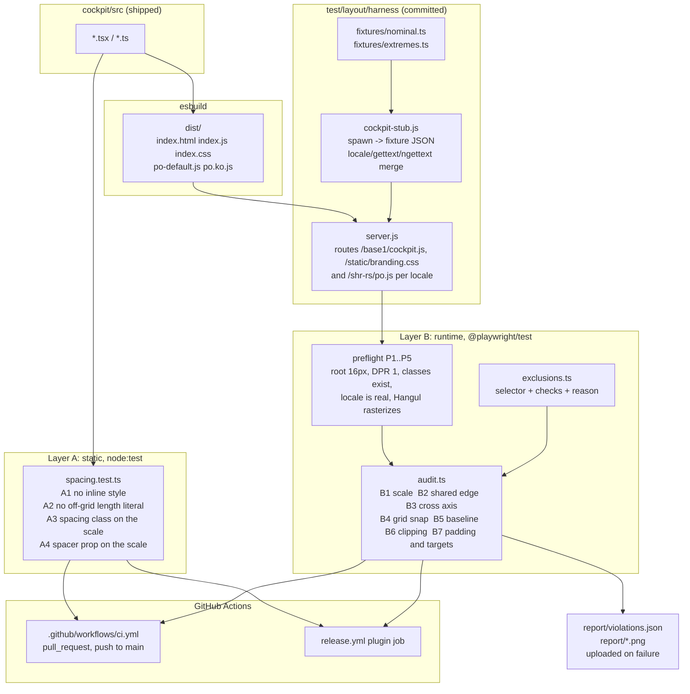

# Layout Grid, Alignment and Padding Audit Toolchain - Spec Proposal

| Item       | Detail                           |
|------------|----------------------------------|
| Author     | heavycaffeiner(Dong Hyun Kim)    |
| Created    | 2026-08-10                       |
| Status     | **Draft** / In Review / Approved |
| Reviewers  |                                  |

---

## 1. Summary

This proposal adds a two-layer audit that checks the Cockpit plugin's spacing
against a 4px grid, checks that sibling elements share their edges, and checks
that no box is clipped or padded by a value that could not have been authored.
Layer A is a source scan that runs under the existing `node:test` runner; layer
B measures the rendered page in Chromium through `@playwright/test`, driven by a
fixture harness that is committed rather than thrown away and that renders both
shipped locales, since Korean changes font metrics and line breaking rather than
only string lengths. Both layers run on every pull request through a new CI
workflow, and again in `release.yml` so a tag cannot ship an unaudited bundle.

## 2. Background & Motivation

### 2.1 What already exists

The plugin ships zero local CSS. `src/index.tsx` imports only
`patternfly-base.css` and `patternfly-addons.css`, and `build.js` registers no
Sass plugin. Every spacing decision is therefore either a PatternFly component
prop, a `pf-v6-u-*` utility class, or a PatternFly component default.

Measured against the current tree, that discipline is holding:

| Signal | Count |
|---|---|
| `style={{` inline styles in `src/*.tsx` | 0 |
| `px` literals in `src/*.tsx` | 0 |
| Spacing utility classes used (`pf-v6-u-mb-md` x3, `pf-v6-u-mt-xs` x2) | 5 |
| `hasGutter` | 40 |
| `spaceItems={{ default: "spaceItems{Xs,Sm,Md,Lg}" }}` | 8 |
| `minWidths={{ default: "220px" }}` | 2 |

The repository also already has the shape this proposal extends.
`src/tokens.test.ts` scans `src/` for colour literals and fails the suite on a
match; `src/patternfly.test.ts` pins the five `@patternfly/*` packages to one
release and guards its own scan with a minimum file count so a moved directory
fails loudly instead of passing vacuously. A source-scanning rule test is an
established pattern here, not a new idea.

### 2.2 The 4px grid is already almost true, and it is measurable why

PatternFly 6.6.0's spacer scale, read out of the bundled
`patternfly-base.css`:

| Alias | Token | Value | px at a 16px root |
|---|---|---|---|
| `xs`  | `spacer--100` | 0.25rem | 4 |
| `sm`  | `spacer--200` | 0.5rem  | 8 |
| `md`  | `spacer--300` | 1rem    | 16 |
| `lg`  | `spacer--400` | 1.5rem  | 24 |
| `xl`  | `spacer--500` | 2rem    | 32 |
| `2xl` | `spacer--600` | 3rem    | 48 |
| `3xl` | `spacer--700` | 4rem    | 64 |
| `4xl` | `spacer--800` | 5rem    | 80 |

Every semantic spacer token aliases into that scale rather than introducing a
value of its own: `spacer--control--vertical--compact` is `xs`,
`spacer--gap--control-to-control--default` is `xs`,
`spacer--gutter--default` is `md`, `spacer--gap--group-to-group--horizontal--default`
is `2xl`, and so on for all sixteen of them.

The same holds for PatternFly's own component rules, which is the fact that
makes a universal runtime check viable. The built `dist/index.css` carries 2626
`padding` / `margin` / `gap` declarations. Of those, 247 are a bare `0`, 84 are
`0 !important`, 84 are `auto !important`, 39 are `auto`, 3 are `initial`, and
the remaining 2163 are `var()` references. Fifty of those 2163 wrap the
reference in a `calc()`, and every one of the fifty is a `* -1` negation of a
spacer-derived custom property, so a negated multiple of 4 rather than a new
value. Six declarations, across five rules, carry an em/px/% literal:

| Selector | Declaration |
|---|---|
| `.pf-v6-c-table__tree-view-main > .pf-v6-c-table__toggle .pf-v6-c-button` | `margin-block-start: -50%` |
| `.fa-ul` | `margin-left: 2.5em` |
| `.fa-border` | `padding: 0.2em 0.25em 0.15em` |
| `.fab.fa-pull-left`, `.fab.fa-pull-right` | `margin-right: 0.3em`, `margin-left: 0.3em` |
| `.sr-only` | `margin: -1px` |

None of the five is reachable from this plugin's markup: it renders no
tree-view table and uses no Font Awesome legacy class, and `.sr-only` is a
visually-hidden clip box rather than a layout inset.

So a rule of the form "every nonzero computed spacing value must be one of
{4, 8, 16, 24, 32, 48, 64, 80}px" does not need a PatternFly exemption. It is
satisfied by PatternFly's own components by construction, and a violation
therefore means something genuinely left the scale.

One precondition rides on this, and it is load-bearing. The scale is `rem`
based, and neither `patternfly-base.css` nor the plugin declares
`html { font-size }`, so the px column above is a claim about a 16px root and
nothing else. A session with a larger default font size moves every value off
the 4px grid at once. The audit therefore asserts the root font size before it
asserts anything else, and aborts rather than reporting a page full of bogus
violations.

### 2.3 What is missing

**Nothing pins any of it.** The counts in §2.1 are the current state, not an
invariant. A single `style={{ padding: 6 }}` or a `pf-v6-u-mb-2` typo lands
without a word from any check, and the typo case is worse than the literal
case: a class name that does not exist in the stylesheet is silently ignored by
the browser, so the author sees no spacing and no error.

**Source reading cannot see the defects that actually shipped.** Proposal 0's
§8.7 and §8.8 are the evidence. The capacity allocation card rendered 197px tall
around 227px of content and cut its caveat text off mid-line; every check in
that round was blind to it, because the content was clipped *inside* a scroll
container, so nothing stuck past the viewport and `scrollWidth - clientWidth`
stayed 0 in all four combinations. The dialog sweep then found three more of
the same family: a close button whose sibling margin landed on the wrong
element and left the title running underneath it, titles truncating exactly
where the group name is, and a `<fieldset>` sitting at 344px inside a 326px
body because a UA default `min-inline-size: min-content` refused to shrink. All
four were found by measuring geometry in a browser, and none of them is visible
in the source.

**The rig that found them is not in the repository.** It was written for that
round and discarded. Every future round starts from nothing.

**Every measurement so far was taken against one locale's text.** The four
defects above were all found in an English render. §8.5 then confirmed that a
real session runs under `<html lang="ko-kr">`, and §8.5.2 walked it in Korean,
but that walk asserted theme, overflow and stacking rather than re-measuring
geometry. Korean is not a longer-strings variant of English: Red Hat Text
carries no Hangul, so Korean text falls back to a CJK face with different
ascent and descent, and CJK line breaking splits between characters rather than
at word boundaries. Line box heights and wrap points both move, which means the
block-axis geometry of the entire page is different and has never been
measured.

**There is no pull-request CI.** `.github/workflows/release.yml` is the only
workflow, and it triggers on tag push and `workflow_dispatch`. Its `plugin` job
runs `npm test`, `npm run typecheck` and `npm run eslint`, so those three do run,
but not until someone cuts a release. Between tags nothing is enforced.

**One accessibility finding is open.** §8.8 recorded that the create-group
wizard's five disk-selection checkboxes are bare 13x13 inputs, under WCAG
2.5.8's 24x24 minimum, because they sit in table cells with an `aria-label` and
no `<label>` element. It was left unfixed at the time. This proposal enforces
the rule and fixes them.

## 3. Goals & Non-Goals

### 3.1 Goals

- [ ] Enforce that every spacing value the plugin's own source names is a
      multiple of 4px, statically, at the point where authorship is knowable.
- [ ] Enforce at runtime that every nonzero computed padding, margin and gap on
      the rendered page is one of the eight resolved spacer values.
- [ ] Check the four alignment properties the operator actually sees: shared
      edges between siblings, cross-axis alignment within a row, text baseline
      agreement, and 4px snapping of layout box edges.
- [ ] Check that padding is present where a box paints its own edge, that no
      two adjacent controls sit closer than the grid unit, and that every hit
      target meets 24x24.
- [ ] Keep the §8.7 and §8.8 clipping regressions caught: a check for overflow
      inside a scroll container, not only past the viewport.
- [ ] Audit both shipped locales. Korean changes string lengths, font metrics
      and line-breaking rules independently of each other, so it is a different
      layout rather than a longer-strings variant, and §8.5 confirmed it is what
      a real session renders.
- [ ] Commit the fixture harness so the rendered page under audit is a
      permanent, reviewable asset that needs no VM and no guest.
- [ ] Run both layers on every pull request and every push to `main`, and again
      in `release.yml`, as a hard failure.
- [ ] Fix every violation the audit finds before the gate is switched on, so no
      baseline file is created and no debt is carried in a data file.
- [ ] Keep the plugin at zero local CSS. The one known 24x24 violation is fixed
      by markup, not by a stylesheet.

### 3.2 Non-Goals

- [ ] No Rust, no CLI, and no TUI. A terminal UI is laid out on a character
      cell, so a 4px grid does not apply to it, and no alignment rule proposed
      here transfers.
- [ ] No CI for the Rust crates. The new workflow covers `cockpit/` only.
      Adding `cargo` jobs to a pull-request workflow is a separate decision.
- [ ] No baseline or allowlist file for existing violations. Violations are
      fixed in Phase 3 before the gate is armed in Phase 4.
- [ ] No visual regression testing, no screenshot diffing, no pixel baselines.
      Screenshots are captured as failure evidence only, never asserted on.
- [ ] No new dashboard features, no `model.ts` parsing change, no `actions.ts`
      argv change, no new translatable strings.
- [ ] No PatternFly version bump. All five packages stay at 6.6.0.
- [ ] No locale beyond the two catalogues that exist. `po/en.po` and `po/ko.po`
      are audited; a third language is covered when a third catalogue lands, not
      before.
- [ ] No enforcement of translation completeness. A key `po/ko.po` has not
      covered falls back to English and is counted in the report, but does not
      fail the run. That is an i18n policy decision, not a layout one.
- [ ] No audit against a live Cockpit session in CI. The harness is the CI
      entry point; running the same checks against the guest stays a manual
      option and is not wired up here.

## 4. Technical Design

### 4.1 Architecture Overview

Nothing in the shipped module graph changes. Every addition is a test asset or
a CI file.



The two layers divide by what each can know. Layer A knows *authorship*: it
reads the plugin's own source, so a value it finds was written by this project.
Layer B knows *geometry*: it reads a real layout, so it sees the composed result
that no source file states. Neither can do the other's job, which is why both
exist.

Locale is an input to layer B only, and it enters through the harness's routing
rather than through a runtime call. `index.html` applies both catalogues before
the bundle's first line runs, so which language the page is in is decided by
what the server answers for `po.js`, and cannot be changed afterwards.

### 4.2 Data Model Changes

No change to any shipped data structure. No schema, no `state.toml` field, no
JSON payload shape, and no parsing rule in `model.ts`.

New files, all of them test or CI assets:

```
cockpit/src/spacing.test.ts                  layer A
cockpit/test/layout/harness/server.js        static server, node:http
cockpit/test/layout/harness/cockpit-stub.js  window.cockpit shim, incl. locale merge
cockpit/test/layout/fixtures/nominal.ts      populated, realistic
cockpit/test/layout/fixtures/extremes.ts     boundary values
cockpit/test/layout/audit.ts                 the seven check functions
cockpit/test/layout/exclusions.ts            exclusion entries with reasons
cockpit/test/layout/dashboard.spec.ts        dashboard matrix
cockpit/test/layout/dialogs.spec.ts          dialog matrix
cockpit/playwright.config.ts                 runner config
.github/workflows/ci.yml                     pull_request and push to main
```

The fixtures are typed against `model.ts`'s exported `StatusReport` and
`FsDfReport`, so a model change breaks them at `tsc --noEmit` time rather than
producing a page that silently renders less than it should.

### 4.3 Core Logic

#### 4.3.1 The grid unit, and the five preconditions it rests on

The grid unit is 4 CSS pixels. The audit works in px and asserts the facts that
make px meaningful, and that make the run be what it says it is, before it
measures anything.

- **P1.** `getComputedStyle(document.documentElement).fontSize` is exactly
  `"16px"`. Every value in §2.2's px column is `rem * 16`; if the root moves,
  the entire scale moves with it and every subsequent assertion is meaningless.
- **P2.** `window.devicePixelRatio` is exactly `1`. A fractional device pixel
  ratio produces fractional box coordinates from integral CSS lengths, which
  would read as off-grid.
- **P3.** Every class token named in `src/*.tsx` that starts `pf-v6-` or
  `pf-m-` appears as a class token in some selector in the built
  `dist/index.css`. This is the typo guard. It covers the `pf-v6-c-` component
  classes and the `pf-m-` modifiers as well as the `pf-v6-u-` utilities, because
  `createGroupWizard.tsx:113` names `pf-v6-c-modal-box pf-m-align-top pf-m-md`
  directly and a typo there fails exactly as silently. The test is token
  presence anywhere in a selector, not a standalone rule, since a `pf-m-`
  modifier only ever appears compounded onto its component class. It lives here
  rather than in layer A because it needs a build, which layer B already
  guarantees.
- **P4.** The run is in the locale it claims. In a `ko` run,
  `document.documentElement.lang` is `ko` and a known Korean-only string from
  `po/ko.po` is present in the DOM; in an `en` run that string is absent. Both
  directions are asserted, because a stub that silently failed to apply the
  Korean catalogue would otherwise produce a full set of English runs labelled
  Korean, every one of them passing.
- **P5.** In a `ko` run, Hangul actually rasterizes. Measured by rendering `가`
  and a private-use codepoint (`U+E000`) offscreen at the same font size and
  comparing their advance widths: if they match, both are the missing-glyph box
  and no CJK face is installed.

P5 exists because its failure mode is invisible to every other check. A browser
with no Korean font still lays the page out, still puts the Korean text in the
DOM, and still passes P4; it just draws tofu. The metrics measured on those
boxes are the notdef glyph's, not the font's, so the entire Korean run would be
green and meaningless. This is the one new failure mode the locale axis
introduces that has no analogue in the English runs.

The consequence for CI is that the font set has to be pinned rather than
inherited: the workflow installs `fonts-noto-cjk` explicitly instead of relying
on whatever the runner image happens to ship, so a Korean measurement is
reproducible between the runner and a developer's machine.

That pin is also an honest limitation. The Korean geometry this audit measures
is Noto Sans CJK KR's, which is what the harness pins, not necessarily what the
Rocky guest resolves for Hangul. A CJK face with different metrics shifts every
block-axis coordinate in the Korean runs. Confirming the guest's own face stays
a live-session question of the kind §8.5 answers, and this audit does not claim
to have answered it.

A failed precondition **aborts the run** with that precondition named. It never
degrades into reporting violations, because a run under a broken precondition
produces nothing but noise.

The comparison tolerance is **ε = 0.5px**, applied before any modulo test.
Layout rounds to device pixels, and free-space distribution in flex and grid
produces genuinely fractional lengths from integral inputs. The two predicates:

```
onGrid(v)   :=  abs( abs(v) - 4 * round(abs(v) / 4) )  <=  0.5
onScale(v)  :=  v == 0  or  min over s in SCALE of abs( abs(v) - s )  <=  0.5
SCALE       =  { 4, 8, 16, 24, 32, 48, 64, 80 }
```

`onScale` takes `abs(v)` because §2.2 measured 50 spacing declarations that are
`* -1` negations of a spacer value; a negative multiple is still on the scale.
`onScale` is strictly stronger than `onGrid`: 12px and 20px are on the 4px grid
but are not spacer values, and §2.2's measurement says nothing in the bundle
produces them.

#### 4.3.2 Layer A: the static rules

`src/spacing.test.ts` follows `tokens.test.ts` exactly in shape. It reads every
`.ts` / `.tsx` under `src/` excluding `*.test.ts`, skips comment lines (which is
the correction `tokens.test.ts` already had to make, after it caught two hex
literals in prose describing the old `app.scss`), and asserts a minimum file
count before asserting anything else so a moved directory fails loudly.

| Rule | Statement | Current violations |
|---|---|---|
| **A1** | No `style={{` anywhere in `src/`. | 0 |
| **A2** | No length literal outside the grid. A string or numeric literal matching `\d+(\.\d+)?(px\|rem\|em)` must satisfy `onGrid` for `px`, or be a multiple of 0.25 for `rem`. `em` is rejected outright, since it is relative to an inherited font size and cannot be checked against a fixed grid. | 0 |
| **A3** | Every `pf-v6-u-` class matching the spacing family `(m\|p)(t\|r\|b\|l\|x\|y)?-` must name a scale step: `none\|xs\|sm\|md\|lg\|xl\|2xl\|3xl\|4xl`, optionally suffixed `-on-(sm\|md\|lg\|xl\|2xl)`. Anything else in that family fails. | 0 |
| **A4** | Every `spaceItems`, `gap`, `rowGap`, `columnGap` prop value must be one of PatternFly's named constants (`spaceItemsXs` and siblings, `gapXs` and siblings). A raw string or number fails. | 0 |

A1 is the reason A2 and A3 are sufficient rather than merely indicative: with
inline styles banned outright, there is no remaining route by which the source
can set a length that the class scanner cannot see. A1 currently costs nothing,
because there are already none.

`minWidths={{ default: "220px" }}` passes A2: 220 is 4 x 55.

Layer A finds nothing today. That is the point. It is a ratchet against future
drift, not a cleanup, and it is cheap because it runs in the existing suite with
no new dependency.

#### 4.3.3 The fixture harness

The plugin's `index.html` loads `../base1/cockpit.js`, then `po-default.js`,
then `po.js`, then `index.js`, and `src/cockpit.ts` throws immediately if
`window.cockpit` is absent. The harness satisfies that contract without
rewriting a single shipped file.

`server.js` is a `node:http` static server over the real `dist/` directory,
mounted at `/shr-rs/`, with three route overrides:

| Request | Served |
|---|---|
| `/base1/cockpit.js` | `harness/cockpit-stub.js` |
| `/static/branding.css` | empty 200, since branding is shell chrome the plugin does not lay out |
| `/shr-rs/po.js` | locale dependent, see below |

The relative paths resolve to exactly those requests: from `/shr-rs/index.html`,
`../base1/cockpit.js` is `/base1/cockpit.js`, and `../../static/branding.css`
clamps at the root to `/static/branding.css`. `dist/index.html`, `index.js` and
`index.css` are therefore served byte for byte as shipped. This matters: the
audit's subject is the artefact that goes into the RPM, not a re-bundled
approximation of it.

`po.js` reproduces cockpit-ws's negotiation exactly as `build.js` measured it on
a Cockpit 356 guest, rather than a convenient approximation of it:

| Locale under audit | `/shr-rs/po-default.js` | `/shr-rs/po.js` |
|---|---|---|
| `en` | `dist/po-default.js` | 200 with an **empty body** |
| `ko` | `dist/po-default.js` | `dist/po.ko.js` |

The empty body for English is not a shortcut. cockpit-ws sends nothing for a
session it considers untranslated, English included, which is precisely why the
English catalogue ships under the unnegotiated name `po-default.js` in the first
place. Serving `po.en.js` under `po.js` would apply English twice and would
audit a load order no session ever sees.

`cockpit-stub.js` defines `window.cockpit` with the members
`src/cockpit.ts`'s `CockpitApi` declares, plus the one member that interface
does not name but `index.html` depends on:

- **`locale(catalog)`**, which both catalogue files call at load. It merges by
  `Object.assign` into a single store, so Korean lands on top of English and any
  key `po/ko.po` has not covered still reads as English, which is the
  per-string fallback `build.js` documents. It reads `language` and
  `language-direction` off the catalogue's `""` header entry.
- **`gettext(key)`**, returning `store[key][1]` or the key itself. The catalogue
  format is `[context, msgstr0, msgstr1, ...]` with a null first element, which
  is why the lookup is index 1 and not index 0.
- **`ngettext(key1, keyN, n)`**, indexing through the header's `plural-forms`
  function. `po/en.po` declares two forms and `po/ko.po` declares one, so this
  member is not decoration: getting it wrong changes what the counted-noun
  strings render as, and those are the ones with a number in them.
- **`format`**, `language`, `language_direction`, and `spawn`.

`spawn` dispatches on the argv it is given and resolves the fixture JSON for
that command; an unrecognised argv rejects with a `CockpitError` shaped like a
real one, so an audit run cannot silently render an empty page because a
command was renamed.

The stub takes `language` from the merged catalogue header, so a Korean run puts
`ko` on `<html lang>` where a live session puts `ko-kr` (§8.5). Both select the
same font fallback and the same line-breaking rules, so the difference does not
reach layout, but it is the one place the harness is knowingly not the live
session.

Two fixture sets, selected by a query parameter the stub reads:

- **`nominal`** is a realistic populated dashboard: an SHR group with multiple
  bands, RAID5 and RAID6 slices, real-length `by-id` disk names, an `fs_uuid`, a
  mix of member counts. This is what the guest cannot produce, since it has no
  btrfs module and therefore no SHR group, and it is exactly the set of surfaces
  §8.5.1 recorded as uncovered by the in-session run.
- **`extremes`** is the boundary set: the longest plausible `by-id` name, a
  group name at its length limit, 0-byte and maximum capacities, an empty
  member list, and a single-disk group. Layout defects surface at the extremes
  of a value, not at its middle, and every one of the four §8.8 defects was a
  long-string defect.

The catalogue strings are not a fixture concern, because they are not fixture
data: they arrive through `po-default.js` and `po.js`, and whichever of them is
longest is already on the page in the run for its locale. That is the whole
reason the locale axis in §4.3.6 exists rather than being simulated with a long
placeholder string.

#### 4.3.4 Layer B: the seven checks

Each check states its subject set, its predicate, and its exclusions. An
exclusion is only ever a stated reason, never a convenience.

**B1 - spacing is on the scale.**
Subject: every element under the audited root, for each of `padding-top`,
`padding-right`, `padding-bottom`, `padding-left`, the four `margin-*`,
`row-gap` and `column-gap`.
Predicate: `onScale(value)`.
This is the runtime counterpart of A2 and A3, and §2.2's measurement is what
makes it applicable to PatternFly's own elements rather than only to ours.

**B2 - vertically stacked siblings share their edges.**
Subject: every element with two or more in-flow element children forming a
single column, where "single column" means each child's border-box top is at or
below the previous child's bottom, within ε.
Predicate: all children's border-box inline-start coordinates agree within ε,
and all their inline-end coordinates agree within ε.
Exclusions, each because the child's width is legitimately content-derived
rather than authored: children whose computed `display` is inline-level;
children whose resolved `align-self` (or the parent's `align-items`) is
anything other than `stretch` or `normal`, since a non-stretching flex child
shrinks to its content by design; absolutely positioned and floated children;
list markers.

**B3 - cross-axis alignment within a row.**
Subject: every element whose computed `display` is `flex` or `inline-flex` with
`flex-direction: row`, restricted to the children sharing one flex line.
Predicate, by the container's resolved `align-items`: `center` requires the
children's vertical centres to agree within ε; `flex-start` requires their tops
to agree; `flex-end` requires their bottoms to agree; `stretch` requires both.
`baseline` defers to B5.
This is the "top and bottom line up" half of the requirement, and it is stated
against the container's own declared intent rather than against an assumption,
so a row that deliberately centres is not reported for failing to top-align.

**B4 - layout box edges snap to the grid.**
Subject: elements whose computed `display` is `block`, `flex`, `grid` or
`table`, descending from the audited root.
Predicate: `onGrid` on the border-box inline-start coordinate and the
inline-size, and on the block-start coordinate and the block-size.
Exclusions, each because the length is a division result or a font metric
rather than an authored value: any descendant of a `table` with
`table-layout: auto`, since column widths are content-derived; elements whose
computed `flex-grow` is nonzero, since their width is a share of free space;
elements whose parent's `grid-template-columns` contains an `fr` track, for the
same reason; the block-axis test on elements whose children are all text, since
line box height follows font metrics and has no reason to be a multiple of 4.

B4 is the noisiest of the seven and its exclusion list is the one most likely to
grow. **Phase 2 carries an explicit decision gate for it**: after the inventory
is measured, if quieting B4 requires exclusions covering more than a quarter of
the audited elements, the measurement is reported and the decision to keep,
narrow or drop B4 is taken then. It is not silently downgraded to a warning,
because a check that reports findings nobody acts on is worse than no check.

**B5 - text baselines agree.**
Subject: pairs of sibling text-bearing elements sharing a line box, and flex
rows whose resolved `align-items` is `baseline`.
Predicate: the two elements' first text nodes, measured through
`Range.getClientRects()`, have bottom edges agreeing within ε.
Two preconditions on each pair. First, the two elements' computed `font-size`,
`font-family` and `line-height` are identical. Second, both text runs are in the
same script, decided by whether each contains a codepoint in the Hangul ranges
(`AC00-D7A3`, `1100-11FF`, `3130-318F`). Where either precondition fails, equal
rect bottoms no longer imply equal baselines, so the pair is **skipped and
counted as unchecked** rather than guessed at. The unchecked count is printed
with the results, so the coverage limit is visible rather than implied.

The script precondition is not redundant with the font one, and the Korean run
is why. Computed `font-family` is the declared list, not the font actually used:
Red Hat Text carries no Hangul, so a Korean label falls back to a system CJK
face while a Latin value beside it stays in Red Hat Text, and
`getComputedStyle` reports the same `font-family` for both. The two faces have
different ascent and descent metrics, so their text-box bottoms differ by design
even when the layout engine has aligned their baselines perfectly. Without this
precondition every mixed-script line in the Korean run would be reported, which
is most of the page.

Mixed-font and mixed-script rows are consequently not covered by B5. They are
covered by B3's centre alignment instead, which is the property PatternFly
actually sets for them, and which is measured on border boxes rather than on
font metrics and so is unaffected by fallback.

**B6 - clipping and overflow.**
This is the §8.7 and §8.8 regression guard, ported from the rig described there
including its three corrections.
Predicates: (a) `documentElement.scrollWidth <= clientWidth`; (b) no element's
border box extends past the viewport's inline edges; (c) no element has
`scrollHeight > clientHeight + ε` or `scrollWidth > clientWidth + ε`.
Predicate (c) is the one that matters, and it is the one the original round did
not have. The capacity card that shipped broken was clipped inside a scroll
container, so (a) and (b) both passed on it.
Exclusions, each already established by measurement in §8.7 and §8.8 as
PatternFly's own deliberate truncation with the full text still reachable: a
`Label`'s text ellipsis, a table column header's ellipsis,
`.pf-v6-c-page__main` (the page's intended vertical scroll), and `ModalBody`
(the dialog's intended vertical scroll).

**B7 - padding presence, neighbour gap, and hit targets.**
Three predicates, all of them measuring the realized result rather than the
declared property, because §8.7 showed declared padding and realized inset are
not the same question.

- **B7a, realized inset.** For every element that paints its own edge, meaning
  a `background-color` with nonzero alpha differing from its parent's used
  background, or any `border-*-width` greater than 0: measure the gap on each
  side between the element's padding box and the union bounding box of its
  in-flow descendants' painted content. The gap must be **either exactly 0 or at
  least 4px**. A value strictly between 0 and 4 is the violation.
  This is the formulation that makes the rule mechanical instead of a matter of
  taste. A full-bleed child, a table filling a card, a progress bar spanning its
  container, is legitimately 0. A properly inset child is at least one grid
  unit. A gap of 1, 2 or 3 pixels is never authored on this scale; it is always
  the residue of a stray margin or a rounding, and it is the "the number is
  touching the card edge" defect stated in a form a machine can decide.
  It also sidesteps the false positive that a declared-padding rule would hit
  immediately: PatternFly's `Card` has padding 0 and its inset comes from
  `CardBody`, which a declared-padding check would report and a realized-inset
  check correctly passes.
- **B7b, neighbour gap.** For every pair of adjacent interactive elements
  (`a`, `button`, `input`, `select`, `textarea`, `[role="button"]`,
  `[role="checkbox"]`, `[role="link"]`) whose border boxes are adjacent along an
  axis, the gap must be at least 4px. The threshold is the grid unit itself, and
  it is also what PatternFly uses:
  `--pf-t--global--spacer--gap--control-to-control--default` resolves to `xs`,
  which is 4px. Choosing anything larger would be a design opinion this proposal
  has no basis for.
- **B7c, hit target.** Every interactive element's hit area must be at least
  24 x 24 CSS px, per WCAG 2.5.8. The hit area is **the `<label>` that contains
  or references the control where one exists, otherwise the control itself**.
  That distinction is the first of §8.8's two corrections to its own sweep: the
  earlier version measured the bare input and reported targets a finger never
  lands on.

#### 4.3.5 Noise control, and the rule that keeps it honest

First, the distinction that keeps `exclusions.ts` from being the baseline file
§3.2 rules out. An exclusion states that a check does not *apply* to a kind of
element, for a structural reason: a table column width is content-derived, so
B4 cannot mean anything there. A baseline states that a check applies, fails,
and is tolerated anyway. The first is part of the rule; the second is debt in a
data file. Nothing goes in `exclusions.ts` that a violation report could have
been written for instead.

Three mechanisms enforce that, because §8.8 recorded the cost of the
alternative: a checker that cries wolf gets ignored.

1. **Exclusions carry reasons.** `exclusions.ts` exports entries of the shape
   `{ selector, checks, reason }`. A self-test in the same suite fails if any
   entry has an empty `reason`.
2. **Unused exclusions fail.** After a full run, any exclusion entry whose
   selector matched no element in any audited page fails the suite. An
   exclusion list that can rot is a list that will rot.
3. **Every check must be demonstrated to fail before it is accepted.** For each
   of B1 through B7, a fixture variant is constructed that violates it, and the
   check must report exactly that violation on the variant and nothing on the
   clean build. This is the discipline `tokens.test.ts` already went through:
   it was confirmed failing against a deliberately inserted literal before being
   accepted, and doing so is what surfaced its comment-line false positive. A
   check that has only ever been seen passing has not been tested.

#### 4.3.6 The audit matrix

| Page | Locales | Themes | Viewports | Fixtures | Runs |
|---|---|---|---|---|---|
| Dashboard | en, ko | light, dark | 1280x900, 390x844 | nominal, extremes | 16 |
| 9 dialogs | en, ko | light, dark | 390x844 | nominal | 36 |

52 runs. Each is a page load plus one injected measurement pass, so the axis
that dominates wall clock is the page load, not the checks.

The dialogs are audited at phone width only, which is where all four §8.8
defects were found and where a modal's stack of scroll containers is under the
most pressure. The theme axis is retained for the dialogs because B7a reads
computed colour to decide its subject set: "paints its own edge" depends on
`background-color`, and a box distinguishable from its parent in one theme may
not be in the other.

**Why locale is a full axis and not a spot check.** Korean is what the operator
this plugin exists for actually sees: §8.5's in-session run rendered under
`<html lang="ko-kr">` throughout. It changes layout through three independent
mechanisms, none of which an English run exercises:

- **Different string lengths.** Every label, button, column header and error
  hint has a different width. Every one of the four §8.8 defects was a
  long-string defect, and which string is longest differs by catalogue.
- **Different font metrics.** Red Hat Text carries no Hangul, so Korean text
  falls back to a system CJK face with its own ascent, descent and advance
  widths. Line box heights change, which moves every block-axis coordinate on
  the page.
- **Different line breaking.** CJK text breaks between most characters rather
  than at word boundaries, so a Korean label wraps where its English
  counterpart overflows, and overflows where its English counterpart wraps.
  B6's clipping predicates are directly sensitive to this in both directions.

Because of the second and third, a Korean run is not a longer-strings variant
of the English one. It is a different layout, and simulating it with a
placeholder string would reproduce only the first mechanism.

Theme is set the way the shell sets it, by toggling `.pf-v6-theme-dark` on
`document.documentElement`, which is the contract `darkTheme.ts` already
implements and which §8.5 confirmed the real shell drives. Locale is set by the
harness serving the catalogues for that locale, per §4.3.3, not by a runtime
switch, because `index.html` applies both catalogues before the bundle's first
line runs and there is no supported way to change that after load.

**One coverage limit, stated rather than implied.** `cockpit.locale` merges, so
a key `po/ko.po` has not translated falls back to its English string, and that
string is then audited under Latin metrics in a run that claims to be Korean.
Measured today, this affects nothing: `po/en.po` and `po/ko.po` each carry 470
msgids and `po/ko.po` has zero empty `msgstr` entries outside its header, so the
Korean page is fully Korean. The audit reports the fallback count per run anyway,
because that number is a property of the catalogue at the time of the run and
not of this proposal. A nonzero count does not fail the run; it appears in the
report so a reader knows which parts of the Korean page were not Korean.

#### 4.3.7 The 24x24 fix, in markup

The create-group wizard's five disk-selection checkboxes are the one known B7c
violation. `createGroupWizard.tsx:344` renders PatternFly's `Checkbox` with an
`aria-label` and no `label` prop. PatternFly emits the associated
`<label htmlFor>` only when `label` is given, so what reaches the page is a bare
input at the browser's native 13x13, a size PatternFly overrides nowhere.

The fix passes `label` instead of `aria-label`, carrying the device name. That
is what `createGroupWizard.tsx:422`'s force-content checkbox, the only other
checkbox in the plugin, already does, and it is why that one has a full-width
target. A visible `<label>` also supplies the accessible name, so keeping
`aria-label` alongside it would only let the two drift apart.

Two consequences Phase 3 measures rather than assumes. The select column will
carry the device name that the node column already shows, so the row states it
twice; and the column will widen to fit that text, which changes the disk
table's layout at both widths. If either turns out to be worse than the defect,
the fallback is PatternFly's own `Td select={{ ... }}` API, which renders a
labelled select cell without a visible duplicate. Both routes keep the plugin at
zero local CSS, which was the reason the finding was left open in the first
place.

## 5. API Design

### 5-1. New / Modified

No network API. The contract is the exported check functions, the harness's
route map, and the two npm scripts.

#### New: `cockpit/src/spacing.test.ts`

```ts
/**
 * Guards the 4px grid at the point where authorship is knowable. A value
 * found here was written by this project; a value found in the browser was
 * composed from ours and PatternFly's and cannot be attributed. That split is
 * why this file and test/layout/ both exist rather than one replacing the
 * other.
 *
 * Scans .ts/.tsx under src/, excluding *.test.ts, skipping comment lines.
 * Asserts a minimum file count first so a moved directory fails loudly rather
 * than passing on an empty scan, which is the same guard patternfly.test.ts
 * uses.
 */
```

Pseudocode:

```
SCALE_STEPS = { none, xs, sm, md, lg, xl, 2xl, 3xl, 4xl }
BREAKPOINTS = { sm, md, lg, xl, 2xl }
SPACE_PROPS = { spaceItems, gap, rowGap, columnGap }

files <- readdir(src) filtered to .ts/.tsx, excluding *.test.ts
assert files.length >= 8

for file in files:
    for (lineNo, line) in enumerate(read(file)):
        if isCommentLine(line): continue

        // A1
        if line contains "style={{":
            offend(A1, file, lineNo, line)

        // A2
        for (value, unit) in matchAll(/(\d+(?:\.\d+)?)(px|rem|em)/, line):
            if unit == "em":                       offend(A2, ...)
            if unit == "px"  and not onGrid(value): offend(A2, ...)
            if unit == "rem" and (value * 4) % 1:   offend(A2, ...)

        // A3
        for cls in matchAll(/pf-v6-u-(?:m|p)[trblxy]?-[a-z0-9-]+/, line):
            step, bp <- parse(cls)
            if step not in SCALE_STEPS:            offend(A3, ...)
            if bp is present and bp not in BREAKPOINTS: offend(A3, ...)

        // A4
        for (prop, value) in matchAll(/(spaceItems|gap|rowGap|columnGap)=\{\{([^}]*)\}\}/, line):
            for v in parseBreakpointObject(value):
                if not v matches /^(spaceItems|gap)(None|Xs|Sm|Md|Lg|Xl|2xl|3xl|4xl)$/:
                    offend(A4, ...)

assert offenders.length == 0, message listing rule, file, line, matched text
```

#### New: `cockpit/test/layout/audit.ts`

```ts
/** One reported defect. `expected` is stated so a reader can act on the
 *  report without re-deriving the rule. */
export interface Violation {
    check: "B1" | "B2" | "B3" | "B4" | "B5" | "B6" | "B7a" | "B7b" | "B7c";
    selector: string;      // unique CSS path to the offending element
    property: string;      // e.g. "padding-left", "inline-start", "gap"
    actual: number;
    expected: string;      // e.g. "one of 4,8,16,24,32,48,64,80"
    text: string;          // first 60 chars of the element's text, for locating it by eye
}

/** Result of one page audit. `unchecked` carries B5's skipped pairs so the
 *  coverage limit is visible in the report rather than implied by silence.
 *  `untranslatedKeys` is the same idea for the locale axis: in a `ko` run it
 *  counts the strings that fell back to English and were therefore measured
 *  under the wrong font metrics. */
export interface AuditResult {
    locale: "en" | "ko";
    violations: Violation[];
    unchecked: { check: string; reason: string; count: number }[];
    untranslatedKeys: number;
    elementsScanned: number;
}

/**
 * Asserts P1 through P5, then runs every check over the subtree at
 * `rootSelector`. Throws on a failed precondition rather than returning: a run
 * under a broken precondition produces noise, not findings.
 */
export const auditPage = async (
    page: Page,
    rootSelector: string,
    locale: "en" | "ko",
): Promise<AuditResult> => { ... };
```

P4 and P5, defined in §4.3.1, are the two preconditions the locale axis adds.
Both guard against the same class of outcome: a Korean run that produces 26
green results while measuring something other than a Korean page.

The implementation of every check runs inside `page.evaluate`, since all seven
need `getComputedStyle` and `getBoundingClientRect` against the live layout.
`audit.ts` is the serialization boundary: it injects one function, receives the
`AuditResult`, and does no measurement of its own in Node.

#### New: `cockpit/test/layout/exclusions.ts`

```ts
/** A check exemption. `reason` is required: a self-test in the suite fails on
 *  an empty one, and a full run fails on any entry that matched nothing, so
 *  the list cannot rot into a list of things nobody remembers. */
export interface Exclusion {
    selector: string;
    checks: Violation["check"][];
    reason: string;
}
```

Seeded with the four §8.7 and §8.8 exemptions and the B4 structural ones from
§4.3.4. Nothing else is added without a measurement behind it.

#### New: `cockpit/package.json` scripts

```
"layout":        "playwright test",
"layout:report": "playwright show-report"
```

`npm test` is unchanged in its command but gains `spacing.test.ts` through its
existing `src/*.test.ts` glob.

#### Modified: `cockpit/src/createGroupWizard.tsx`

```
disk selection cell (line 344)
    <Checkbox
      id={`wizard-disk-${disk.name}`}
-     aria-label={format(_("wizard.disks.selectAria"), disk.name)}
+     label={`/dev/${disk.name}`}
      isChecked={...} isDisabled={...} onChange={...} />

PatternFly renders the associated <label htmlFor> only when `label` is set.
aria-label is dropped rather than kept: the visible label supplies the
accessible name, and two sources for one name drift apart.
```

#### New: `.github/workflows/ci.yml`

```yaml
name: ci
on:
  pull_request:
  push:
    branches: [main]
concurrency:
  group: ci-${{ github.ref }}
  cancel-in-progress: true
jobs:
  plugin:
    runs-on: ubuntu-latest
    steps:
      - checkout
      - setup-node 22
      - make .npm-installed          # npm ci, through the Makefile's own stamp
      - npm test                     # includes spacing.test.ts
      - npm run typecheck
      - npm run eslint
      - npm run build                # dist/ is layer B's subject
      - cache Playwright browsers, keyed on the resolved @playwright/test version
      - npx playwright install --with-deps chromium
      - apt-get install -y fonts-noto-cjk    # pinned, not inherited: see P5
      - npm run layout
      - upload-artifact test/layout/report/  if: failure()
```

The font install is a separate step rather than a line folded into the
Playwright one, because it is the audit's own requirement and not the browser's.
`playwright install --with-deps` installs the packages Chromium needs to start,
which does not include a Korean face, and a Chromium that starts fine renders
Hangul as tofu without complaint.

#### Modified: `.github/workflows/release.yml`

The `plugin` job's `Check` step gains `npm run build` and `npm run layout`, with
the same Playwright install and cache steps. The reason is the same one the
existing step's comment already gives for `npm ci`: a release must build the
tree that was tested. An audited pull request that lands and then ships through
an unaudited release job would leave the gate half-closed.

### 5-2. Error Handling

No REST surface. The table is failure modes, each with how it is detected,
because a failure that is only visible by eye is one this project has
repeatedly shipped past.

| Failure mode | Detection | Handling |
|---|---|---|
| Root font size is not 16px in the audit browser | P1, before any measurement | Abort the run naming P1. Every px assertion depends on it, so continuing would report the whole page as off-grid. |
| Device pixel ratio is not 1 | P2 | Abort naming P2. Fractional geometry from integral CSS lengths is indistinguishable from a real off-grid value. |
| A `pf-v6-` or `pf-m-` class named in source does not exist in `dist/index.css` | P3 | Fail with the class name and the file that names it. This is the typo case the browser currently swallows silently. |
| A `ko` run renders English, because the stub's `locale` merge or the `po.js` route is wrong | P4, asserting `lang` and the presence of a Korean-only string, and its absence in the `en` run | Abort naming P4. Without this, a broken Korean path produces 26 duplicate English runs that all pass, which is the one outcome worse than a failure. |
| `ngettext` indexes the wrong plural form, so counted-noun strings render as the other form | The `extremes` fixture drives both the `n == 1` and `n > 1` branches, and P4's Korean-only probe string is a counted noun | Run fails. `po/en.po` declares two plural forms and `po/ko.po` one, so a naive stub that ignores `plural-forms` breaks Korean specifically. |
| No CJK font on the machine running the audit, so Hangul draws as tofu | P5, comparing the advance of `가` against a private-use codepoint | Abort naming P5. Every other check passes on a tofu page: the layout happens, the text is in the DOM, P4 is satisfied. Only the glyph metrics are wrong, and they are what the Korean run exists to measure. |
| A Korean string falls back to English because `po/ko.po` does not cover it | Counted into `AuditResult.untranslatedKeys` | Reported, not failed. Measured at 0 today across all 470 msgids. Translation completeness is an i18n decision, not a layout one. |
| `dist/` is stale or absent when layer B runs | The harness compares `dist/index.js` mtime against the newest file in `src/`, and 404s from the static server surface as a Playwright navigation failure | Run fails. Verifying a stale bundle is the specific failure proposal 0 recorded twice. |
| `window.cockpit` missing, so `src/cockpit.ts` throws at import | The page renders empty; `elementsScanned` falls below the minimum the spec asserts | Fail with the scanned count. A vacuous pass on a blank page is the worst outcome available here, so it is asserted against directly. |
| `spawn` called with an argv the stub does not recognise | The stub rejects with a `CockpitError`-shaped object | The dashboard renders its error branch, `elementsScanned` drops, and the run fails. A renamed command cannot silently reduce coverage. |
| A fixture drifts from `model.ts` | `tsc --noEmit`, since fixtures are typed against the exported interfaces | Build fails before the audit runs. |
| An exclusion entry has no reason | Self-test in the layout suite | Suite fails naming the entry. |
| An exclusion matches nothing | Post-run check over the accumulated match counts | Suite fails naming the entry. Prevents the list rotting. |
| B4's exclusion list grows past a quarter of scanned elements | Reported as a ratio at the end of every run | Phase 2 decision gate. Reported to the author, not silently tolerated. |
| B5 skips a pair because fonts or scripts differ | Counted into `AuditResult.unchecked` | Printed with the results. The coverage limit is stated, never implied by silence. The skip rate is expected to be materially higher in the Korean runs, since Hangul falls back off Red Hat Text and most mixed lines pair a Korean label with a Latin value. |
| Playwright's Chromium download fails in CI | The install step's exit code | Job fails. The browser is cached on its resolved version, so a repeat run does not re-download. |
| A real violation is found | Any check | Job fails. `report/violations.json` and the failure screenshots upload as an artifact, each violation carrying selector, property, actual, expected and the element's leading text. |

## 6. Implementation Plan

### 6-1. Milestones

Each phase leaves the tree green and is independently reviewable. Phase 1 does
not depend on Phase 2 and could ship alone.

| Phase   | Task | Estimated Duration | Owner |
|---------|------|--------------------|-------|
| Phase 1 | **Static layer and CI foundation.** `src/spacing.test.ts` with A1 through A4. New `.github/workflows/ci.yml` running the existing three checks plus the new one on `pull_request` and `push` to `main`. Exit: the workflow is green on a pull request, and each of A1 through A4 has been demonstrated failing against a deliberately inserted violation before being accepted. Current source has zero violations, so this phase arms a ratchet rather than paying down debt. | 0.5 day | heavycaffeiner |
| Phase 2 | **Harness and audit library, reporting only.** `harness/server.js` with the three route overrides and the locale-dependent `po.js` negotiation, `harness/cockpit-stub.js` including the `locale` merge and `plural-forms` indexing, the `nominal` and `extremes` fixtures typed against `model.ts`, `audit.ts` with P1 through P5 and B1 through B7, `exclusions.ts` seeded from §8.7 and §8.8, and the two spec files covering the §4.3.6 matrix. Not wired into CI yet. Exit: the full 52-run matrix executes locally, P4 has been demonstrated failing in both directions and P5 against a machine with the CJK font removed, every check has been demonstrated failing on a purpose-built bad fixture, and `report/violations.json` is the deliverable. **Includes the B4 decision gate**: report the exclusion ratio and decide keep, narrow or drop. | 2 days | heavycaffeiner |
| Phase 3 | **Fix the inventory.** Fix every violation Phase 2 found, including the known B7c case: give the wizard's five disk checkboxes a `label` prop in place of `aria-label`, and measure the two layout consequences §4.3.7 names. Zero local CSS throughout. Exit: the matrix reports zero violations in both locales, and no exclusion was added without a measurement behind it. | 1 to 3 days, pinned after Phase 2 measures | heavycaffeiner |
| Phase 4 | **Arm the gate.** Add `npm run build` and `npm run layout` to `ci.yml`, with the Playwright install and browser cache. Add the same to `release.yml`'s `plugin` job. Upload `report/` on failure. Exit: a pull request carrying a deliberately introduced off-grid value fails CI with that value named, and reverting it turns the run green. | 0.5 day | heavycaffeiner |

Phase 3's duration is deliberately a range. The violation count is unknown until
Phase 2 measures it, and the two prior rounds recorded in proposal 0 §8 both
found defects that were not predicted from reading the source. Committing to a
number here would be inventing one. The Korean runs are the likelier source of
findings, since they are the half of the matrix whose geometry has never been
measured at all, which is why the range is wider than it would be for English
alone.

**Ordering constraint.** Phase 4 must not land before Phase 3 completes. Arming
a hard gate against a tree with known violations would either block every pull
request or force the baseline file §3.2 rules out.

### 6-2. Dependencies

**New library dependencies.** One:

- `@playwright/test`, as a devDependency, plus the Chromium build it downloads.
  This is a real cost and worth naming: it is the second test runner in a
  repository that has had exactly one, it adds a browser binary to CI, and it is
  the largest devDependency in the tree. It buys the fixtures, retries,
  reporters and trace viewer that a hand-rolled CDP client would otherwise have
  to reimplement, and the trace on a CI failure is what makes a geometry
  violation diagnosable without reproducing it locally.

**Existing dependencies used, nothing added.**

- `node:http`, `node:fs`, `node:path` for the harness server.
- `node:test` and `node:assert/strict` for layer A, matching every other test
  in the package.
- `@patternfly/patternfly` 6.6.0's spacer tokens, as the source of the eight
  scale values.
- The plugin's own `dist/` output, served byte for byte, including `po.ko.js`
  and `po-default.js`. The catalogues are build output, not a new asset, so the
  locale axis adds no fixture data.

**Environment dependencies.**

- Node 22, already pinned by `package.json`'s `engines` and by both workflows.
- Chromium, obtained through `npx playwright install --with-deps chromium` in
  CI and cached on the resolved `@playwright/test` version. No system browser is
  assumed.
- `fonts-noto-cjk` on the machine running layer B. This is a hard requirement,
  not a nicety: without a Korean face the Korean half of the matrix measures
  missing-glyph boxes and reports green, which P5 exists to prevent. Pinning the
  package rather than inheriting the runner's fonts is also what makes a Korean
  measurement reproducible between CI and a developer's machine.
- No VM, no Cockpit guest, no `shr-rs` binary, and no Rust toolchain. The
  harness is the entire environment layer B needs, which is what makes it
  runnable on a GitHub-hosted runner.

**Nothing required from another team.** Single-maintainer repository.

## 7. References

Repository files carrying the measurements and the reasoning this proposal
builds on.

- `docs/proposals/shr-rs-0-cockpit-theme-and-responsive.md` §8.7 - the capacity
  card clipped inside a scroll container, why every check in that round was
  blind to it, and the nested-column-flexbox chain that caused it. B6's
  predicate (c) exists because of this section.
- The same document §8.8 - the four dialog defects, and the two corrections the
  sweep had to make to itself. B7c's "measure the label, not the input" rule and
  B6's ellipsis exclusions both come from here, as does the open 24x24 finding
  Phase 3 closes.
- The same document §8.2 - the before-and-after measurement that falsified three
  of that proposal's own diagnoses. The reason §4.3.5 requires every check to be
  demonstrated failing before it is accepted.
- `cockpit/src/tokens.test.ts` - the source-scanning rule test this proposal's
  layer A copies, including the comment-line skip it had to add.
- `cockpit/src/patternfly.test.ts` - the guard-the-guard minimum-count pattern,
  and the measurement of what a dangling design token silently does.
- `cockpit/src/cockpit.ts` - the `CockpitApi` interface the harness stub must
  satisfy, and the throw that fires when `window.cockpit` is absent.
- `cockpit/src/index.html` - the four-script load order the harness must
  reproduce, and why `po-default.js` precedes `po.js`.
- `cockpit/build.js` - the `dist/` layout the harness serves, the absence of a
  Sass plugin that makes zero local CSS structural rather than conventional, and
  the measured cockpit-ws negotiation (`po.js` empty for English, `po.ko.js` for
  Korean, `po.en.js` unreachable by name) that §4.3.3's route table reproduces
  instead of approximating.
- `cockpit/src/i18n.ts` - why `cockpit.gettext` already answers in the session
  language before the bundle's first line runs, which is what forces the locale
  to be a harness route rather than a runtime switch.
- `cockpit/po/ko.po` - the catalogue the Korean half of the matrix renders. 470
  msgids, none untranslated, measured while writing this.
- `cockpit/src/ui.tsx` - `MONO` and `ACTION_ROW`, the shared class constants
  that are the plugin's only local styling vocabulary.
- `.github/workflows/release.yml` - the `plugin` job whose `Check` step this
  proposal extends, and its comment on why `npm ci` runs through the Makefile
  stamp.

External references.

- PatternFly 6 spacer tokens, the source of the eight scale values:
  https://www.patternfly.org/tokens/all-patternfly-tokens
- PatternFly 6 about tokens, on semantic tokens aliasing into the base scale:
  https://www.patternfly.org/tokens/about-tokens
- WCAG 2.2 Success Criterion 2.5.8 Target Size (Minimum), the 24x24 rule and its
  spacing exception, which B7b and B7c implement:
  https://www.w3.org/WAI/WCAG22/Understanding/target-size-minimum.html
- Playwright test runner and its Chromium installation:
  https://playwright.dev/docs/test-configuration
- MDN `Range.getClientRects()`, the measurement B5 uses to reach a text
  baseline:
  https://developer.mozilla.org/docs/Web/API/Range/getClientRects
- MDN `getComputedStyle`, on resolved versus computed values, which decides what
  B1 through B4 actually read:
  https://developer.mozilla.org/docs/Web/API/Window/getComputedStyle
- CSS Text Module Level 3, on line breaking around CJK, which is the mechanism
  that makes a Korean render a different layout rather than a longer one:
  https://www.w3.org/TR/css-text-3/#line-breaking
- MDN `word-break`, for the CJK-specific behaviour the same section relies on:
  https://developer.mozilla.org/docs/Web/CSS/word-break
- Cockpit package development guide, on a package not linking into another
  package's files, which is why the harness stubs `../base1/cockpit.js` rather
  than vendoring it:
  https://cockpit-project.org/guide/latest/packages.html

## 8. Implementation outcome

Written after the four phases landed. Four things came out different from the
design above, and this section records what and why so the code and the proposal
do not disagree.

### 8.1 B4 was dropped, not narrowed

§4.3.4's decision gate resolved to drop. The measurement, taken over the full
52-run matrix against 24,918 elements:

| | Off grid | Of measured | Distinct element paths |
|---|---|---|---|
| Position edges | 3,328 | 6,136 (54.2%) | |
| Sizes | 5,046 | 6,136 (82.2%) | |
| Total B4 violations | 8,374 | of 8,445 across all checks | 64 |

The population is typography, not authored geometry. 880 boxes are 20.8px tall,
which is the 16px type scale at line-height 1.3; another 674 are 21px. Every box
that follows a line of text inherits that fraction, and every flex item sized by
the remainder inherits whatever is left over. Splitting integer from fractional
(positions 758 integer against 2,570 fractional, sizes 2,700 against 2,346)
showed the 59 distinct fractional-position elements are all downstream of text,
so narrowing B4 to whole pixels would have re-reported the same cascade under a
smaller number.

Reaching zero would mean fixed widths, which are exactly what breaks Korean at
390px, so the check would have pulled against P1 and B6. The user's stated
criterion was to check only values this package writes, and B1 already does that
at the source: it reads the declared margins, paddings and gaps and passes on all
52 runs. B4 measured the browser's arithmetic instead.

`audit.ts` carries no B4. The `CheckId` union has a comment at the gap saying
why, so the absence reads as a decision rather than an omission.

### 8.2 B7c implements WCAG 2.5.8's spacing exception, not only its size clause

As specified in §4.3.4, B7c was a bare size floor, and it reported 23 violations
that the criterion itself permits. WCAG 2.5.8 has five normative exceptions, and
**Spacing** is the one that applies here: an undersized target conforms when a
24 CSS pixel circle centred on it intersects no other target's bounding box, nor
another undersized target's circle. A 13px row-select checkbox alone in a table
row is conformant markup. A size-only check rejects every row-select column and
every icon toolbar on the web, and a check that fires on conformant markup is one
somebody switches off.

B7c now collects targets first, applies the size floor, and reports only when a
neighbour sits inside the spacing that would otherwise excuse it. The size floor
still measures the label union where a real `label` element exists, per §4.3.4.

Two independent pieces of evidence that this is a correctness fix and not a way
to make the matrix go green:

- The self-test still drives B7c to failure, on two flush 20x20 buttons, and
  asserts no other check fires on that markup.
- A throwaway probe measured the real clearances rather than trusting the
  arithmetic. The wizard's disk checkboxes sit 80px apart between centres
  against a 24px requirement, and the expand dialog's force-content check clears
  its nearest neighbour by 27.5px against a 12px radius. Both clear comfortably,
  not marginally.

23 undersized targets still exist and are evaluated on every run, so the check is
not vacuous.

### 8.3 Phase 3 came out empty

With B4 dropped and B7c corrected, the matrix reports zero violations against
unmodified markup. No source file under `cockpit/src/` was changed, so §6-1's
Phase 3 has nothing in it and its ordering constraint on Phase 4 is satisfied
trivially.

§4.3.7's planned markup change does not follow from a gate failure any more. The
wizard's disk checkboxes carry an `aria-label` and no `label`, which is still a
real affordance concern: a screen reader names the control, and a pointer gets
13x13 to hit. But the conflict §4.3.7 framed, where a `label` prop was the way to
satisfy B7c, was resolved by measurement rather than by markup. A `label` on its
own leaves the row 21px tall, so it would not have satisfied the old B7c either.
It is a design call, not a gate fix, and it is left as one.

### 8.4 Two harness deviations

- **Locale and fixture selection moved from the server into Playwright.**
  §4.3.2 put the three route overrides in `harness/server.ts`. `index.html`
  requests `../base1/cockpit.js` and `po.js` with no query string, so a server
  could only tell one variant from another by sniffing `Referer`. The overrides
  are `page.route()` and `page.addInitScript()` in `harness/routes.ts` instead,
  and the server does nothing but serve `dist/` with a traversal guard.
- **No `npm run layout:report`.** The global teardown already prints the
  per-check summary and writes `test/layout/report/violations.json`, so a second
  script would have run the same code a second time.
