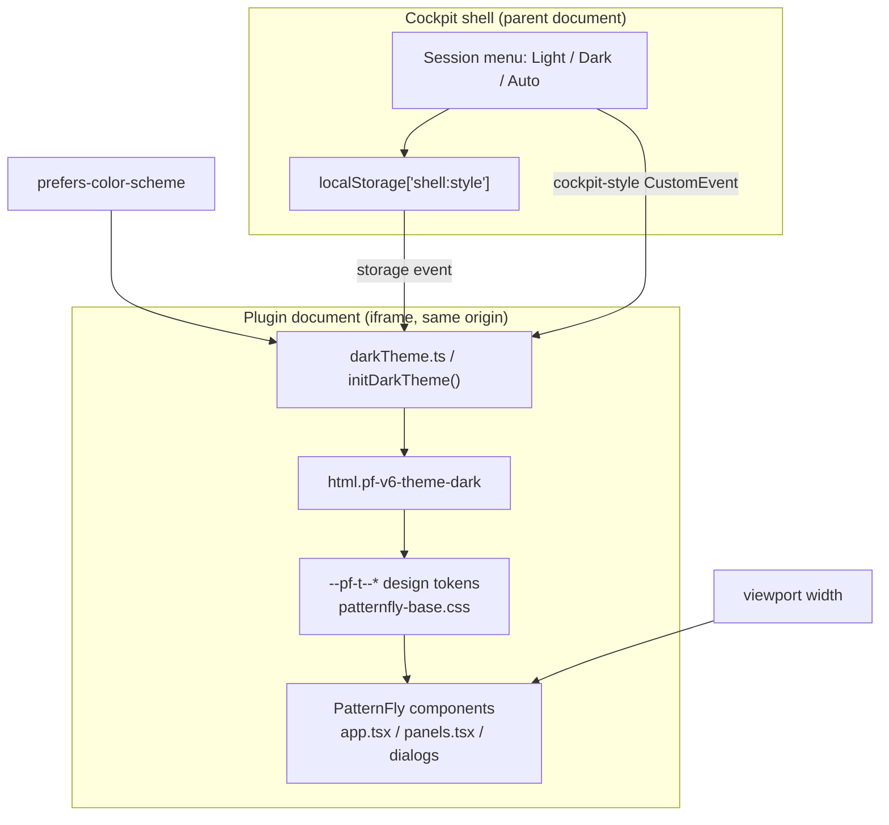

# Cockpit Plugin Theme Fidelity and Responsive Layout - Spec Proposal

| Item       | Detail                           |
|------------|----------------------------------|
| Author     | heavycaffeiner(Dong Hyun Kim)    |
| Created    | 2026-08-06                       |
| Status     | **Draft** / In Review / Approved |
| Reviewers  |                                  |

> **Implementation note, 2026-08-06.** All three phases are done. §8 records what
> the browser actually showed, including three diagnoses in §2.2 that turned out
> to be wrong and one fix that was removed after measuring that it did nothing.
> §2 through §7 are left as written so those corrections stay legible as
> corrections. Verification ran twice: §8.4 in a fixture harness with a fully
> populated dashboard, §8.5 in a real Cockpit session on the guest.

---

## 1. Summary

The SHR-RS Cockpit plugin already tracks the Cockpit shell's light/dark
preference through `src/darkTheme.ts`, but that path has never been confirmed
in a real browser and a handful of surfaces still bypass the design tokens.
Separately, the plugin's layout assumes a desktop-width frame: its page header,
card titles, and horizontal description lists do not reflow, and long
unbreakable identifiers (filesystem UUIDs, `by-id` disk names) force the whole
page to scroll horizontally on a phone.

This proposal closes both gaps without introducing a plugin-local stylesheet.
The shell remains the only source of theme truth, and every layout fix is
expressed as a PatternFly component prop or a `pf-v6-u-*` utility class.

## 2. Background & Motivation

### 2.1 What already exists

`src/darkTheme.ts` is a port of Cockpit's own `pkg/lib/cockpit-dark-theme.ts`.
It resolves `localStorage["shell:style"]` (`auto` | `light` | `dark`) against
`prefers-color-scheme` and toggles `.pf-v6-theme-dark` on
`document.documentElement`. It subscribes to all three signals that can change
the answer: the `storage` event, Cockpit's `cockpit-style` CustomEvent, and a
`matchMedia` change listener. `src/darkTheme.test.ts` pins the pure resolver
across both sides of both discriminators.

PatternFly 6.6.0's `patternfly-base.css` carries
`:where(.pf-v6-theme-dark) { color-scheme: dark; }`, so native UA surfaces
(scrollbars, form control chrome) follow the class as well. All five installed
`@patternfly/*` packages are pinned to one release, and `src/patternfly.test.ts`
guards that invariant.

The plugin also ships zero local CSS. `src/index.tsx` imports only
`patternfly-base.css` and `patternfly-addons.css`; `src/ui.tsx`'s header records
that the previous hand-copied palette drifted from the shell it sat beside, and
`build.js` deliberately registers no Sass plugin. Responsive tables are already
correct: PatternFly's `Table` defaults to `gridBreakPoint: grid-md`, and every
`Td` in `panels.tsx` (16) and `createGroupWizard.tsx` (5) carries a `dataLabel`,
so all four tables collapse into stacked cards below 768px.

### 2.2 What is missing

**Theme.** The dark path has only ever been exercised by a unit test over a pure
function. Nothing has confirmed that the class actually lands before first paint
in a plugin iframe, nor that every rendered surface reads from tokens. Two
surfaces are known to bypass them today:

- `src/actionsDialogs.tsx:227` draws its modal close affordance as a literal
  `×` text character inside a `pf-m-plain` button, while
  `src/createGroupWizard.tsx:250` uses PatternFly's `TimesIcon` for the same
  control. The text glyph renders in the body font at the body's own size and
  colour, so the two dialogs' close buttons do not match each other in either
  theme.
- Nothing prevents a future edit from reintroducing a hardcoded colour literal.
  The "no local design system" rule is currently documentation only, and the
  project has already lived through one drift of exactly that kind.

**Responsive.** Four concrete defects, all reachable at a 390px viewport:

| # | Location | Symptom |
|---|----------|---------|
| 1 | `app.tsx:355` page header `Flex` | No `flexWrap`. The `h1`, subtitle, health badge and two buttons stay on one line and compress into each other. |
| 2 | `Split hasGutter` at `app.tsx:184`, `panels.tsx:122`, `panels.tsx:481`, `panels.tsx:674` | `Split` does not wrap without `isWrappable`. Card titles and their right-aligned figures overlap. |
| 3 | `DescriptionList isHorizontal` at `panels.tsx:513`, `panels.tsx:733`, `panels.tsx:792`, `actionsDialogs.tsx:376`, `actionsDialogs.tsx:719`, `createGroupWizard.tsx:517` | Horizontal at every width. A term column plus a value column leaves roughly 150px for values on a phone. |
| 4 | `ui.tsx:29` `MONO` | `pf-v6-u-font-family-monospace` alone. Values such as an `fs_uuid` or `ata-WDC_WD40EFRX-68N32N0_WD-WCC7K4PJ0K1S` are single unbreakable tokens; they overflow their container and make the entire document scroll horizontally. |

Two further surfaces need measurement rather than an assumed fix:
`ActionList` in `OperationsPanel` (`actionsDialogs.tsx:1980`, six buttons in one
row) and the `CodeBlock` command preview (`actionsDialogs.tsx:246`, long argv
lines).

### 2.3 Why now

Cockpit itself is usable from a phone, and an operator most plausibly reaches a
storage dashboard from one precisely when something is already wrong: a drive
has dropped and they are not at a desk. A dashboard that scrolls sideways and
overlaps its own headings is unusable in that moment, which is the case this
plugin exists to serve.

## 3. Goals & Non-Goals

### 3.1 Goals

- [ ] Keep the Cockpit shell as the single source of theme truth, and confirm in
      a real browser that `Light`, `Dark`, and `Auto` all take effect in the
      plugin frame.
- [ ] Remove the remaining surfaces that render outside the PatternFly token
      system, and add a regression test that fails if a colour literal is
      reintroduced into `src/`.
- [ ] Make every page-level layout reflow at a 390px viewport with no horizontal
      document scrolling.
- [ ] Keep the plugin at zero local CSS. Every change is a PatternFly component
      prop or a `pf-v6-u-*` utility class.
- [ ] Verify all four combinations of {light, dark} x {1280px desktop, 390px
      mobile} in a real browser against a real Cockpit session.
- [ ] Keep `tsc --noEmit`, `eslint src/`, and `node --test src/*.test.ts` green.

### 3.2 Non-Goals

- [ ] No theme toggle inside the plugin. Adding one would put a control in this
      page that exists on no other Cockpit page, and would let the plugin
      overwrite a shell-wide preference.
- [ ] No local stylesheet, no Sass plugin in `build.js`. If PatternFly cannot
      express something, that becomes a separate proposal rather than a
      reintroduced `app.scss`.
- [ ] No Rust changes and no Rust compilation. The CLI is treated as a fixed
      dependency; verification installs a published `shr-rs` package on the
      guest.
- [ ] No new dashboard features, no new CLI surface, no changes to
      `model.ts` parsing or to any `actions.ts` argv.
- [ ] No PatternFly version bump. All five packages stay at 6.6.0.
- [ ] No new translatable strings, so `po/en.po` and `po/ko.po` are untouched.
- [ ] Table responsiveness is not in scope; it already works and is only
      re-confirmed during verification.

## 4. Technical Design

### 4.1 Architecture Overview

Nothing is added to the module graph. Every change lands inside existing files,
and the theme data flow is unchanged.



The theme axis and the width axis are independent and meet only at the leaf
components. Theme is a class on `<html>` consumed by token declarations; width
is consumed by PatternFly's own breakpoint modifiers. No component reads both,
and no component decides either for itself.

Load order is what keeps the theme correct at first paint, and it is unchanged:
`index.html` loads `index.js` as a classic blocking script in `<head>`, so
`initDarkTheme()` runs while `<html>` exists but before `<body>` is parsed.

### 4.2 Data Model Changes

변경 없음. No schema, no `state.toml` field, no JSON payload shape, and no
parsing rule in `model.ts` changes. The plugin renders the same
`StatusReport` / `FsDfReport` it renders today.

### 4.3 Core Logic

#### 4.3.1 T1 - Shell remains the only theme authority

`darkTheme.ts` is unchanged. `resolveDarkMode(style, prefersDark)` keeps its
current contract: an explicit `light` or `dark` wins over the OS, `auto` and any
unrecognised or absent value defer to `prefers-color-scheme`. No plugin-side
write to `localStorage["shell:style"]` is introduced, so the shell's setting can
never be clobbered by this page.

#### 4.3.2 T2 - Close affordance parity

`actionsDialogs.tsx`'s hand-built `Modal` keeps its raw `<button>` element. That
element is deliberate and documented: the file's tests render through
`renderToStaticMarkup`, and PatternFly's real `Modal` returns `null` under SSR,
so the dialog shell is reproduced by hand. Only the button's *content* changes,
from the literal `×` character to `<TimesIcon />`, matching
`createGroupWizard.tsx:250`.

The button keeps `aria-label={_("common.close")}`, keeps `disabled` driven by
`closeDisabled`, and keeps its `title` in-flight reason. `TimesIcon` renders as
an `<svg>` with `aria-hidden`, so the accessible name still comes from the
label, not from the glyph. `actionsDialogs.test.ts` asserts on the `disabled`
attribute and the accessible name, both of which survive.

#### 4.3.3 T3 - Colour-literal regression test

A new `src/tokens.test.ts` reads every `.ts` / `.tsx` file under `src/`,
excluding `*.test.ts`, and asserts that none contains a CSS colour literal.

The detection rule, stated exactly so it is reproducible:

- Match `#` followed by exactly 3, 4, 6, or 8 hex digits and terminated by a
  non-hex-digit or end of string.
- Match `rgb(`, `rgba(`, `hsl(`, `hsla(`, `color(`, `lab(`, `lch(`,
  `oklab(`, `oklch(` case-insensitively.
- Match the `--pf-t--` token prefix only when it appears inside a `style={{`
  attribute, that is, an inline style. Referencing a token through a utility
  class is fine; setting one by hand in JSX is the thing being prevented.

False-positive control matters here, because `src/` legitimately contains
hex-looking text:

- `panels.tsx:203` renders an NVMe critical-warning bitmask via
  `.toString(16)`. That is a call expression, not a `#`-prefixed literal, so the
  rule above does not match it.
- Comments and translation keys may contain the word `color`. The rule matches
  only the listed function-call prefixes and `#hex` forms, not the bare word.

The test mirrors `patternfly.test.ts`'s existing discipline in two ways: it
first asserts that the file scan found at least 8 source files, so a moved or
renamed directory fails loudly instead of passing vacuously, and its failure
message names every offending file with its line and matched text.

#### 4.3.4 R1 - Page header reflow

`app.tsx`'s header is one `Flex` with `justifyContentSpaceBetween` holding a
title `FlexItem` and an actions `FlexItem`, and the actions item is itself a
`Flex`. Both gain `flexWrap={{ default: "wrap" }}`.

With wrapping enabled, `justifyContentSpaceBetween` still applies per flex line,
so at desktop width the layout is byte-for-byte what it is today (one line,
title left, actions right); at 390px the actions item drops onto a second line
and its three children stay on one line if they fit or wrap again if they do
not. No breakpoint-conditional markup and no duplicate rendering path: the same
tree reflows.

#### 4.3.5 R2 - Wrappable card titles

Every `Split hasGutter` used as a card title gains `isWrappable`. `Split` is a
flex row with `flex-wrap: nowrap`; `isWrappable` adds `pf-m-wrap`. The four call
sites are:

| File | Line | Left (`isFilled`) | Right |
|------|------|-------------------|-------|
| `app.tsx` | 184 | Physical drives title and subtitle | raw capacity |
| `panels.tsx` | 122 | `Section` title | note |
| `panels.tsx` | 481 | group name, mode chip, badges | usable bytes |
| `panels.tsx` | 674 | Allocation title | mode list |

`isFilled` on the left item is retained. On a wrapped line it simply occupies
the full width, which is the intended stacked result.

#### 4.3.6 R3 - Breakpoint-aware description lists

Each `DescriptionList isHorizontal` becomes
`DescriptionList orientation={{ md: "horizontal" }}`, dropping `isHorizontal`.

This is not a cosmetic swap and the distinction is load-bearing.
PatternFly's `orientation` prop has no `default` key: its keys are `sm`, `md`,
`lg`, `xl`, `2xl`. Setting `{ md: "horizontal" }` yields
`pf-m-horizontal-on-md`, which is horizontal from the `md` breakpoint (768px)
upward. Below `md` the list falls back to the component's base layout, which is
vertical. Keeping `isHorizontal` alongside it would emit the unconditional
`pf-m-horizontal` as well and pin the list horizontal at every width, defeating
the change. So `isHorizontal` must be removed, not supplemented.

`isCompact` is retained at every site. The six sites are `panels.tsx:513`,
`panels.tsx:733`, `panels.tsx:792`, `actionsDialogs.tsx:376`,
`actionsDialogs.tsx:719`, and `createGroupWizard.tsx:517`.

The `md` breakpoint is chosen to coincide with the tables' existing
`gridBreakPoint: grid-md`, so the whole page changes shape at one width rather
than at two.

#### 4.3.7 R4 - Breaking long identifiers at a single point

`ui.tsx`'s `MONO` constant becomes:

```
"pf-v6-u-font-family-monospace pf-v6-u-text-break-word"
```

`pf-v6-u-text-break-word` is `word-break: break-word !important` from
`patternfly-addons.css`, which the plugin already loads. `word-break: break-word`
breaks a token only when it would otherwise overflow its container, so short
values such as `/dev/sda` are untouched.

`MONO` is the single class used for every character-aligned value in the plugin,
which is exactly why this is a one-line fix rather than a sweep: it already
covers `fs_uuid`, `md_uuid`, `disk.id`, `serial`, `state_path`, the VG/LV names,
`system_mounts` joins, and the mount point. `Chip` also composes `MONO`, so
member and disk-id chips wrap too.

The one place `MONO` must NOT gain wrapping is the command preview, handled
next, because breaking a shell command mid-token changes what a reader believes
would be executed.

#### 4.3.8 R5 - Command preview containment

`CommandPreview` renders `<CodeBlockCode className={MONO}>` over
`commands.join("\n")`. After R4 that would inherit `break-word`, which is wrong
here: an operator reads this block to confirm the exact argv, and a break
inserted mid-argument invites misreading `--vg-name=shr_vg` as two tokens.

`CodeBlockCode` therefore stops using `MONO` and instead sets the monospace
family utility alone, with horizontal overflow contained inside the block:

```
className="pf-v6-u-font-family-monospace"
```

on the code element, and the enclosing `CodeBlock` given
`pf-v6-u-overflow-x-auto` so a long command scrolls within its own box. The
document itself never gains a horizontal scrollbar, and the command text stays
verbatim.

The exact utility name is confirmed against `patternfly-addons.css` during
implementation; if PatternFly 6.6.0 ships no `overflow-x` utility, the fallback
is `Panel` with `isScrollable`, which is a component prop and so still satisfies
the no-local-CSS goal.

#### 4.3.9 R6 - Action rows

`OperationsPanel` renders six buttons inside one `ActionList`
(`actionsDialogs.tsx:1980`) and two more in a second one at line 2046.
PatternFly's `ActionList` is a flex row. Whether 6.6.0's `ActionList` wraps by
default is measured, not assumed, before changing anything: if it does not, the
list gains PatternFly's own wrapping modifier, or, failing that, the buttons are
regrouped into an `ActionListGroup` per row. No hand-written flex rules.

The destructive button keeps `pf-m-danger` and keeps its position last, so the
visual hierarchy does not change when the row wraps.

#### 4.3.10 R7 - Dialog boxes at phone width

Both modal shells carry `pf-v6-c-modal-box pf-m-align-top pf-m-md`. `pf-m-md`
sets a *max* width, and modal-box's own `--MaxWidth: calc(100% - spacer--xl)`
still clamps below that, so the box is already narrower than a 390px viewport.
What is not yet confirmed is vertical behaviour: with `pf-m-align-top` and a
tall wizard step, the box must stay inside the viewport and `ModalBody` must
scroll rather than the box growing past the bottom edge.

This is a verification item, not a speculative code change. A fix is written
only if the browser shows a problem, and it is written as a PatternFly modifier.

### 4.4 What is deliberately left alone

- `Gallery minWidths={{ default: "220px" }}` in `app.tsx:146` and
  `panels.tsx:627`. At 390px minus page padding there is more than 220px of
  content box, so the gallery already yields a single column.
- All four `Table` elements. They already stack below `md` and every cell has a
  `dataLabel`.
- `index.html`'s `<meta name="viewport" content="width=device-width, initial-scale=1">`,
  which is already correct.
- Every `aria-label`, `aria-live`, and `dataLabel` currently present. Reflow must
  not cost accessible names, and no change here removes one.

## 5. API Design

### 5-1. New / Modified

This is a UI package with no network API. The contract that changes is the
rendered props of exported components, plus one new test module.

#### Modified: `src/ui.tsx`

```ts
/**
 * Class list for character-aligned values: device nodes, UUIDs, serials,
 * `by-id` names. Now also permits a break inside an over-long token, because
 * a filesystem UUID is a single unbreakable word that otherwise forces the
 * whole document to scroll horizontally on a phone.
 *
 * Deliberately NOT used for shell command previews -- see CommandPreview in
 * actionsDialogs.tsx. Breaking a command mid-argument misrepresents what
 * would be executed.
 */
export const MONO = "pf-v6-u-font-family-monospace pf-v6-u-text-break-word";
```

No signature change. `MONO` is a string constant consumed by `className`, so
every call site inherits the behaviour with no edit.

#### Modified: `src/app.tsx`

```
Application()
  PageSection > Flex
-   justifyContentSpaceBetween, alignItemsCenter, spaceItemsMd
+   justifyContentSpaceBetween, alignItemsCenter, spaceItemsMd,
+   flexWrap={{ default: "wrap" }}
      FlexItem (title block)                       unchanged
      FlexItem > Flex (actions)
-       alignItemsCenter, spaceItemsSm
+       alignItemsCenter, spaceItemsSm, flexWrap={{ default: "wrap" }}

  Dashboard()
    Card (physical drives) > CardTitle > Split
-     hasGutter
+     hasGutter, isWrappable
```

#### Modified: `src/panels.tsx`

```
Section()          CardTitle > Split      + isWrappable
GroupCard()        CardTitle > Split      + isWrappable
CapacityOverviewPanel()  allocation CardTitle > Split  + isWrappable

GroupCard()        DescriptionList  - isHorizontal  + orientation={{ md: "horizontal" }}
TechSpecCard()     DescriptionList  - isHorizontal  + orientation={{ md: "horizontal" }}
CapacityMethodologyPanel()  DescriptionList  - isHorizontal  + orientation={{ md: "horizontal" }}
```

#### Modified: `src/actionsDialogs.tsx`

```
Modal()            close <button> children:  "×"  ->  <TimesIcon />
                   (element type, aria-label, disabled, title all unchanged)

CommandPreview()   CodeBlockCode className: MONO -> monospace-only
                   CodeBlock gains horizontal-overflow containment

ScrubDialog()      DescriptionList  - isHorizontal  + orientation={{ md: "horizontal" }}
ExpandDialog()     DescriptionList  - isHorizontal  + orientation={{ md: "horizontal" }}

OperationsPanel()  ActionList wrapping, applied only if measurement shows the
                   6-button row does not already wrap
```

#### Modified: `src/createGroupWizard.tsx`

```
CreateGroupWizard()  DescriptionList  - isHorizontal  + orientation={{ md: "horizontal" }}
```

#### New: `src/tokens.test.ts`

```ts
/**
 * Guards the "no plugin-local design system" rule that ui.tsx's header and
 * index.tsx's stylesheet comment both state in prose. Fails if any source
 * file under src/ names a colour directly instead of inheriting a PatternFly
 * token, which is precisely the drift that produced the old app.scss.
 *
 * Scans .ts/.tsx under src/, excluding *.test.ts. Asserts a minimum file
 * count first so a moved directory fails loudly rather than passing on an
 * empty scan -- same guard-the-guard shape as patternfly.test.ts.
 */
test("no source file hardcodes a colour literal", () => { ... });
```

Pseudocode:

```
files  <- readdir(src) filtered to .ts/.tsx, excluding *.test.ts
assert files.length >= 8            // guard the guard

PATTERNS = [
  /#[0-9a-f]{3,4}(?![0-9a-f])/i,
  /#[0-9a-f]{6}(?![0-9a-f])/i,
  /#[0-9a-f]{8}(?![0-9a-f])/i,
  /\b(rgba?|hsla?|color|lab|lch|oklab|oklch)\s*\(/i,
]

offenders = []
for file in files:
    for (lineNo, line) in enumerate(read(file)):
        for p in PATTERNS:
            if p.test(line): offenders.push({file, lineNo, line})

assert offenders.length == 0, message listing every offender
```

### 5-2. Error Handling

No REST surface, so the table is failure modes rather than status codes. Each
row names how the condition is detected, because a failure that is only visible
by eye is one this project has repeatedly shipped past.

| Failure mode | Detection | Handling |
|---|---|---|
| `orientation` prop rejected by the installed PatternFly typings | `tsc --noEmit` | Build fails before deployment. The prop was read off `DescriptionList.d.ts` in the pinned 6.6.0 tree, so this would mean an unintended version change and `patternfly.test.ts` would also fail. |
| `pf-v6-u-text-break-word` absent from the bundled CSS | grep `dist/index.css` after build | Confirmed present in `patternfly-addons.css` before the edit. If a future PatternFly drops it, the grep catches it and the value falls back to no wrapping, which is a cosmetic regression, never a data error. |
| `TimesIcon` import breaks the SSR-rendered dialog tests | `node --test src/*.test.ts` | `createGroupWizard.tsx` already renders `TimesIcon` under the same test harness, so the pattern is proven. A failure here fails the suite, not the browser. |
| A colour literal is added later | `src/tokens.test.ts` | Suite fails with the offending file, line, and matched text. |
| PatternFly packages drift apart | `src/patternfly.test.ts` | Existing test, unchanged, still fails on a partial bump. |
| Stale plugin copy shadows the deployed one on the guest | `sha256sum` of `dist/index.js` against the guest copy, plus an explicit check for `~/.local/share/cockpit/shr-rs` | Verification is void until the hashes match. This exact shadowing has already invalidated one verification round. |
| Cockpit spawn rejects for lack of admin | existing `errorHintKind` classification on `CockpitError.problem` | Unchanged behaviour. The error `Alert` is itself one of the surfaces checked in both themes. |
| Horizontal document overflow survives a fix | scripted check in the browser: `document.documentElement.scrollWidth > innerWidth` at 390px | Reported as a defect with the offending element identified via `getBoundingClientRect`, not as a subjective impression of a screenshot. |

## 6. Implementation Plan

### 6-1. Milestones

Each phase is independently reviewable and leaves the tree green. Phase 1 and
Phase 2 touch disjoint concerns and could be reordered; Phase 3 depends on both.

| Phase   | Task | Estimated Duration | Owner |
|---------|------|--------------------|-------|
| Phase 1 | **Theme fidelity.** T2 close-affordance parity in `actionsDialogs.tsx`. T3 new `src/tokens.test.ts`. `darkTheme.ts` untouched. Exit: `tsc`, `eslint`, `node --test` all green; `tokens.test.ts` demonstrated failing against a deliberately inserted literal before being accepted. | 0.5 day | heavycaffeiner |
| Phase 2 | **Responsive layout.** R1 header wrap in `app.tsx`. R2 `isWrappable` on four `Split`s. R3 `orientation={{ md: "horizontal" }}` on six `DescriptionList`s. R4 `MONO` gains `text-break-word`. R5 command-preview containment. R6 `ActionList` measured, then fixed only if needed. Exit: same three checks green, and `dist/index.css` confirmed to contain every utility class the source now references. | 1 day | heavycaffeiner |
| Phase 3 | **Real-browser verification.** Install a published `shr-rs` package from GitHub on the Rocky guest (no `cargo`). Build and deploy the plugin, confirm by `sha256sum` and rule out the `~/.local/share/cockpit` shadow. Open Cockpit through the SSH tunnel in the isolated `chrome-shr` profile, log in as `dev`, navigate via the shell's left nav. Walk all four combinations of {Light, Dark} x {1280px, 390px}, plus `Auto` against a flipped OS preference. Record what was seen; fix and redeploy on any defect found. | 1 day | heavycaffeiner |

Phase 3's checklist, applied at each of the four combinations:

1. `document.documentElement.scrollWidth <= window.innerWidth`.
2. Page header: title and both buttons fully visible, none clipped.
3. Every card title readable, with no overlap between the title and its
   right-hand figure.
4. All four tables stacked with visible `dataLabel` headings at 390px, normal
   columns at 1280px.
5. Description lists vertical at 390px, horizontal at 1280px.
6. A group's `fs_uuid` and a disk's `by-id` name wrap inside their container.
7. Open the create-group wizard and one destructive dialog: box inside the
   viewport, body scrolls, close button reachable and correctly disabled while
   an operation is in flight.
8. Command preview scrolls inside its own block, and the command text is
   unbroken.
9. Text and badge contrast legible in the current theme, with status conveyed by
   label text and not by colour alone.
10. Switch the shell's style while the plugin frame is open and confirm the
    change applies without a reload, which is the `cockpit-style` path that has
    never been exercised in a browser.

### 6-2. Dependencies

**Library dependencies.** None added. Everything used already ships in the
pinned tree:

- `@patternfly/react-core` 6.6.0: `Flex.flexWrap`, `Split.isWrappable`,
  `DescriptionList.orientation`.
- `@patternfly/react-icons` 6.6.0: `TimesIcon`, already imported by
  `createGroupWizard.tsx`.
- `@patternfly/patternfly` 6.6.0: `pf-v6-u-text-break-word` and the
  `color-scheme` declarations, both already bundled into `dist/index.css`.
- Node's built-in `node:test`, `node:assert/strict`, `node:fs` for the new test.
  No test framework is added.

**Environment dependencies.**

- A published `shr-rs` package from the project's GitHub releases, installed on
  the Rocky 9.8 guest. Explicitly no Rust toolchain and no cross-build for this
  work; the CLI is a fixed dependency here.
- The guest must serve Cockpit on 9090 over the SSH tunnel on host port 2223,
  with `AllowUnencrypted=true` so plain HTTP works inside the already-encrypted
  tunnel.
- The repo's isolated `chrome-shr` MCP server. The shared global profile is not
  usable: it restarts the browser across concurrent sessions and invalidates
  snapshot uids.
- Login stays `dev` / `1`. The password is not changed.
- Administrative access must be activated in the shell before any write-path
  dialog is opened.

**Ordering constraint.** Phase 3 must run against a build produced after Phase 2
lands. Verifying a stale bundle is the specific failure this project has already
recorded twice, so the `sha256sum` comparison gates the phase rather than
concluding it.

## 7. References

Repository files that carry the reasoning this proposal builds on. Each was read
in full before writing, and each records a defect that constrains a decision
here.

- `cockpit/src/darkTheme.ts` - why the theme must key off the
  `.pf-v6-theme-dark` class and not `prefers-color-scheme`, and why all three
  signals are required.
- `cockpit/src/darkTheme.test.ts` - the both-sides-of-both-discriminators rule
  the new `tokens.test.ts` follows.
- `cockpit/src/patternfly.test.ts` - the single-release invariant, the
  guard-the-guard minimum-count pattern, and the measurement showing what a
  dangling design token silently does.
- `cockpit/src/ui.tsx` - the header recording why the hand-copied `app.scss`
  palette was deleted, which is the rule `tokens.test.ts` mechanises.
- `cockpit/src/index.tsx` - the stylesheet comment stating the plugin has no CSS
  of its own.
- `cockpit/src/app.tsx` - the `pf-m-no-sidebar` and no-`Masthead` notes, and the
  stacking-context defect that made dialog close buttons unclickable. Any header
  change must not reintroduce it.
- `cockpit/src/actionsDialogs.tsx` - why the modal shell is hand-built rather
  than PatternFly's `Modal`, and the browser measurement that produced
  `pf-m-align-top pf-m-md`.
- `cockpit/build.js` - the absence of a Sass plugin, and the cockpit-ws
  measurements behind `po-default.js`.

External references:

- PatternFly 6 design tokens and theming: https://www.patternfly.org/tokens/about-tokens
- PatternFly `DescriptionList` responsive orientation: https://www.patternfly.org/components/description-list
- PatternFly `Table` responsive `gridBreakPoint`: https://www.patternfly.org/components/table
- Cockpit package development guide, on not linking into another package's
  files: https://cockpit-project.org/guide/latest/packages.html
- Cockpit `cockpit.spawn` problem codes, behind `errorHintKind`: https://cockpit-project.org/guide/latest/cockpit-spawn
- MDN `word-break`, for the break-only-on-overflow behaviour R4 relies on: https://developer.mozilla.org/docs/Web/CSS/word-break
- MDN `color-scheme`, for what PatternFly's `.pf-v6-theme-dark` declaration buys: https://developer.mozilla.org/docs/Web/CSS/color-scheme

---

## 8. Outcome (2026-08-06)

### 8.1 Diagnoses in §2.2 that were wrong

Three of the defects this proposal set out to fix did not exist. They are
recorded because each was asserted from reading the source, and each was
falsified by reading the PatternFly stylesheet or by measuring the page.

- **R1, the page header, was not broken.** §2.2 claimed `app.tsx`'s header
  `Flex` had no `flexWrap` and therefore could not reflow. PatternFly's `Flex`
  sets `--pf-v6-l-flex--FlexWrap: wrap` in its base rule, so it already wrapped;
  `flexWrap={{ default: "wrap" }}` would only have re-declared the value already
  in effect. The change was reverted before it shipped and `app.tsx` now carries
  a comment saying so. `Split` is the layout that genuinely does not wrap, which
  is what R2 addresses.
- **R5, the command preview, needed nothing.** `.pf-v6-c-code-block__pre`
  already sets `white-space: pre-wrap` and `overflow-wrap: break-word`, so a
  long argv has always wrapped inside its own block. The proposed
  `pf-v6-u-overflow-x-auto` does not exist in PatternFly 6.6.0 anyway.
- **R6's remedy did not exist as proposed.** `ActionList` has no wrapping
  modifier: `.pf-v6-c-action-list` is a bare `display: flex` with no
  `flex-wrap`, and its only layout prop is the beta `isVertical`, which would
  stack buttons at every width. The fix is `patternfly-addons.css`'s
  `pf-v6-u-flex-wrap` utility, applied through a shared `ACTION_ROW` constant in
  `ui.tsx` (same convention as `MONO`) to all 31 `ActionList` sites.

### 8.2 R4 was wrong too, and the before/after measurement is what showed it

The comments written for R2 and R4 asserted a pre-change state ("the title and
its figure overlapped", "the UUID took the document's horizontal scroll with
it") that had never been observed: only the fixed page had been measured. To
settle it, the bundle at HEAD `4475f95` was built in isolation and put through
the identical rig.

**The pre-change page did not scroll sideways at all.**
`documentElement.scrollWidth - clientWidth` was 0 at 390px, exactly as after.
What it did have was **10 elements past the right edge of the viewport**, and
all ten were `ActionList` buttons. `OperationsPanel`'s row ran to x=1057 in a
390-pixel viewport, so "Replace a disk", "Create a snapshot", "Change
compression" and "Destroy" were clipped by their card. With no document-level
scrollbar to hint at them, they were not merely offscreen: they were
unreachable. That is the one clipping defect this work fixes, and R6, the item
the proposal was least sure of, is what fixes it.

**R4 was unnecessary and was removed.** `MONO` was to gain
`pf-v6-u-text-break-word`. Measured on the pre-change bundle, the longest mono
value on the page (a 44-character `by-id` name) already resolved
`overflow-wrap: break-word` and already wrapped, to 138px inside a 246px parent.
PatternFly sets that on the table cells and description-list descriptions these
values live in, so nothing was overflowing for the class to fix. A variant build
with the class removed was then measured directly: zero overflow and zero
offenders at both widths, byte-for-byte the same wrapping. So it bought nothing,
and it was not free either. While it sat on `MONO` itself it dropped
min-content to one character (`word-break: break-word` is defined as
`overflow-wrap: anywhere`) and let the band table's auto layout squeeze its short
columns to nothing, rendering `band0` as "band" / "0" and `RAID5` as "RAID" / "5"
at 1280px.

The intermediate `LONG_ID` constant introduced to contain that damage was
therefore deleted along with it, and `ui.tsx` carries a note so the next reader
does not re-derive the idea. What actually makes those values readable on a
phone is R3: the description list's value column goes from 135px to 262px when
it stops being horizontal.

**R2 stands, but for the stated mechanism only.** `.pf-v6-l-split` declares no
`flex-wrap`, confirmed `nowrap` at both widths on the pre-change bundle, so its
items can only compress rather than reflow. No Split item was among the ten
clipped elements, so the comments now say that rather than claiming a defect
that was not seen.

### 8.3 Two changes not in the original plan

- `GroupCard`'s member-disk chips now carry `title={id}`. PatternFly's `Label`
  truncates its text with an ellipsis rather than wrapping, and at 390px a
  `by-id` name loses exactly the tail that distinguishes two disks of the same
  model. The full value stays available on hover and to a screen reader.
- The close-button icon in `actionsDialogs.tsx` is wrapped in
  `span.pf-v6-c-button__icon`, which is what PatternFly's own `Button` puts
  around an `icon` prop. Without it the button measured 37x30 against the
  wizard's 37x37, a smaller touch target on the dialogs that include the
  destructive ones. Both are 37x37 now.

### 8.4 What was verified in the fixture harness, and how

Two verification passes were run. This one renders the real production `dist/`
bundle against a stubbed `cockpit` and a hand-built fixture, which is what lets
it exercise a fully populated dashboard the guest cannot produce. §8.5 is the
second pass, in a real Cockpit session.

Both drive a real headless Chrome over the DevTools Protocol. Assertions are
measurements, not screenshots; screenshots were captured as evidence only.

All four combinations of {light, dark} x {1280x900, 390x844}:

| Check | Result |
|---|---|
| `documentElement.scrollWidth - clientWidth` | 0 in all four |
| Elements extending past the viewport | none in all four |
| `.pf-v6-theme-dark` on `<html>` | false / false / true / true |
| Resolved `color-scheme` | light / light / dark / dark |
| Body foreground | `rgb(21,21,21)` light, `rgb(255,255,255)` dark |
| Description-list group grid | 2 tracks at 1280, 1 track at 390 |
| Table `thead` | `table-header-group` at 1280, `none` at 390 |
| Stacked-cell `::before` content | absent at 1280, the column label at 390 |
| `Split` computed `flex-wrap` | `wrap`, with `pf-m-wrap` present |
| `ActionList` computed `flex-wrap` | `wrap`, 6 buttons |
| Longest mono value, a 44-char `by-id` | 138px inside a 246px parent at 390, unchanged from before |

Theme signals, both previously untested in any browser:

- `cockpit-style` CustomEvent: light to dark to light, class follows each time.
- `storage` event on `shell:style`: same, both directions.

Dialogs, all 12 combinations of {wizard, destroy, expand} x {light, dark} x
{390, 1280}:

- Box inside the viewport on both axes everywhere. 374x828 within 390x844 at
  phone width; 840px wide at desktop, matching the stock-Cockpit measurement the
  code comments already cite.
- The wizard's `ModalBody` scrolls (`overflow-y: auto`) rather than the box
  growing past the bottom edge.
- The close button hit-tests to itself at its own centre in all 12, so the
  stacking-context defect that once made it unclickable has not returned.

Static checks: `tsc --noEmit`, `eslint src/`, and 225 tests all green. The new
`src/tokens.test.ts` was confirmed to fail before it was accepted: on its first
run it caught two hex literals, both in `ui.tsx`'s prose describing the old
`app.scss` drift, which is why it skips comment lines.

Deployment: `shr-rs-0.1.0-1.el10.x86_64.rpm` and
`cockpit-shr-rs-0.1.0-1.el10.noarch.rpm` were taken from the v0.1.0 GitHub
release, checksum-verified against `SHA256SUMS` on both host and guest, and
installed on the Rocky 10.2 guest. No Rust was compiled. The plugin was then
overwritten with this build; `index.js` and `index.css` hash-match the host
build, and no `~/.local/share/cockpit` shadow exists.

### 8.5 In-session verification, in the real Cockpit shell

The password was supplied afterwards, so this section replaces what was
originally written here as a gap. Everything below ran against the guest through
the loopback tunnel, driven through Cockpit's own controls.

**Getting in needed https, not http.** The first attempt authenticated
successfully (the journal shows `pam_unix(cockpit:session): session opened for
user dev` and `sudo /bin/cockpit-bridge --privileged`) and then died at the
WebSocket handshake with `received request from bad Origin:
http://127.0.0.1:9090`. The guest's `/etc/cockpit/cockpit.conf` pins `Origins`
to the `https`/`wss` forms of that address, and its own comment records that
setting `Origins` REPLACES cockpit-ws's default same-origin allowance. Since
cockpit-ws sniffs TLS on the same port, switching the client to
`https://127.0.0.1:9090` fixed it with no change to the guest. Worth
remembering: that failure renders as a generic "연결 실패" page and looks like a
plugin fault, which is exactly what the config comment warns about.

Administrative access was granted through the masthead's own "제한된 접근"
control, which answered "이제 관리자 접근 권한이 있습니다" and left the masthead
reading "관리 접근". The theme was changed through the session menu's own
toggle group (기본 / 밝게 / 어둡게), not by writing `localStorage`. The plugin
was reached through the shell's left navigation.

| Check, per {light, dark} x {1280, 390} | Result |
|---|---|
| Plugin frame | `cockpit1:localhost/shr-rs`, same-origin, complete |
| Horizontal overflow inside the frame | 0 in all four |
| Elements past the frame's viewport | none in all four |
| `.pf-v6-theme-dark`, set by the shell's toggle | false / false / true / true |
| `shell:style` as the shell wrote it | light / light / dark / dark |
| Resolved `color-scheme` | light / light / dark / dark |
| Table `thead` | `table-header-group` at 1280, `none` at 390 |
| `ActionList` computed `flex-wrap` | `wrap` |
| `Split` computed `flex-wrap` | `wrap` |
| Danger alert present | false; the real spawn succeeded |

**The `cockpit-style` integration, which the harness could only simulate.** With
the plugin frame already open and no reload, the shell's own theme toggle was
clicked: the frame's `<html>` went dark, then back to light, following each
time. That is the event crossing a real iframe boundary from the shell, not one
this script dispatched inside the frame.

**Two paths the session exercised that the harness could not.** The real
`cockpit.spawn` ran the real `shr-rs status --json` on the guest and the
dashboard rendered its output (1 disk, 85.9 GB, 0/0 RAID members). And before
administrative access was turned on, the dashboard showed the permission branch
correctly: `errorHintKind` classified the rejection as `access-denied` rather
than as a missing install, so the Korean hint read "Cockpit 상단의 '제한된
접근'을 눌러 관리자 권한을 켠 뒤 다시 시도하세요" rather than sending the
operator to debug a PATH problem they do not have. The session ran in Korean
throughout (`<html lang="ko-kr">`).

### 8.5.1 What the in-session run still does not cover

The guest has no SHR group, because its kernel ships no btrfs module (see
below), so the group-dependent surfaces never rendered there: `GroupCard`'s
description list, the band table, and the per-group six-button action row that
R6 exists to fix. In session there were 2 tables and a 2-button action row. Those
three surfaces are covered only by the fixture harness, which is where the
six-button clipping was measured before and after.

Also not covered: real touch input. Sizes were measured, no touch device was
used.

### 8.5.2 Repeated through `chrome-devtools-mcp`

`.mcp.json` was restored with the `chrome-shr` server and the whole in-session
walk was done again through it, by hand rather than by script: click through the
self-signed-certificate interstitial, log in, click the masthead's "제한된
접근", follow the left nav to SHR-RS, and switch 밝게/어둡게 in the session
menu. Same results, plus two things only this pass showed:

- The **a11y tree** confirms the stacked table is stacked for a screen reader
  too, not just visually: below the breakpoint each `gridcell`'s accessible name
  begins with its column label ("노드 /dev/sda …", "용량 85.9 GB"), and the
  `columnheader` nodes drop out of the tree with the `thead`.
- **No console errors or warnings** across the whole session, including with a
  dialog open.

The wizard was opened at narrow width in the live session and measured there:
box 484x764 inside a 500x780 viewport, inside on both axes, `ModalBody` scrolling
at `overflow-y: auto`, close button 37x37 hit-testing to itself with an `<svg>`
inside and `aria-label="닫기"`, the disk table stacked, and zero document
overflow.

Two limits of this route, worth knowing rather than working around: the server
passes no `--ignore-certificate-errors`, so the interstitial has to be clicked
through, and `resize_page` drives a real window that clamps at 500px wide on
Windows. 500px still exercises everything below the 768px breakpoint, but the
actual 390px numbers in this document come from `Emulation.setDeviceMetricsOverride`,
which has no such floor.

### 8.6 Environment drift worth recording

The project notes describe a QEMU Rocky 9 guest on host port 2223 with VM assets
under `.vm/`. None of that is present now. The Cockpit guest is a Hyper-V VM
named `lxc-dev` at 172.17.112.52 running Rocky Linux 10.2 and Cockpit 356.2,
reached through an already-open tunnel on `127.0.0.1:9090`.

Two transfer paths the notes imply are available are not. `Copy-VMFile` fails
because Linux 6.10 and later no longer expose `/dev/vmbus/hv_fcopy`, and `scp`
from the host fails because the guest's key lives inside the hypervm-mcp service
rather than in the host's SSH agent. Guest-to-host HTTP is blocked by the host
firewall. What worked was pushing the tarball through a host-to-guest `ssh`-mode
tunnel into a throwaway receiver on the guest.
